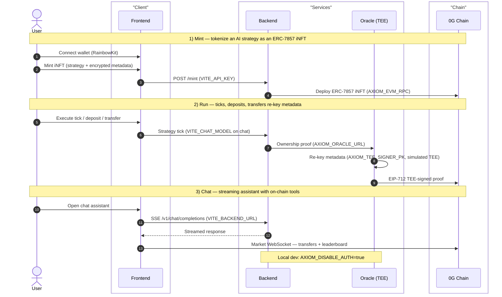

<p align="center">
  
</p>

<p align="center">
  ERC-7857 iNFT agents on <a href="https://0g.ai">0G Chain</a> — mint, trade, and run on-chain AI strategies.
</p>

<p align="center">
  <a href="https://opensource.org/licenses/MIT"></a>
</p>

---

## Overview

Axiom Protocol turns an AI strategy into an **ERC-7857 Intelligent NFT (iNFT)**: an ownable,
transferable on-chain asset whose encrypted metadata is re-keyed on every transfer by a
**TEE-style signer** (simulated TEE today — a Node signer with a cleartext key, not Intel TDX/SEV).
Agents run vaults, execute strategy ticks, and trade on a live 0G Chain market.

## Architecture

The iNFT lifecycle flows through the monorepo — `apps/{contracts,backend,oracle,frontend,indexer}`, `packages/{config,chat-runtime}` — and the TEE signer re-keys encrypted metadata on every transfer. Env vars are noted where each service reads them.



## Prerequisites

- Node ≥ 22, pnpm 11.5.1, Foundry (`forge`) for contracts.

## Quick start (local)

```bash
pnpm install
cp .env.example .env                # canonical template; fill in deployed addresses + secrets
pnpm --filter @axiom/config build
pnpm --filter @axiom/chat-runtime build   # required before backend/oracle dev
pnpm --filter @axiom/oracle dev            # :8787
pnpm --filter @axiom/backend dev           # :3000
pnpm --filter @axiom/frontend dev          # :5173
```

Contracts: `cd apps/contracts && pnpm build && pnpm test`

## Deploy

Railway + Vercel. Root `railway.json` is backend; oracle/indexer use their own.
Railway runs `scripts/railway-build.sh` / `scripts/railway-start.sh` (branch by
`RAILWAY_SERVICE_NAME`); equivalent manual builds are `pnpm --filter @axiom/<svc> build`.
Vercel deploys the frontend only (after backend is up): `vercel --prod`.

## Docs & links

- `docs/README.md` — architecture, security, API.
- `docs/env-vars.md` — full environment-variable table.
- [0G Bridge by AKINDO](https://app.akindo.io/wave-hacks/xKOgjd91kCmrN3ORz/) · https://github.com/symulacr/axiom-protocol
