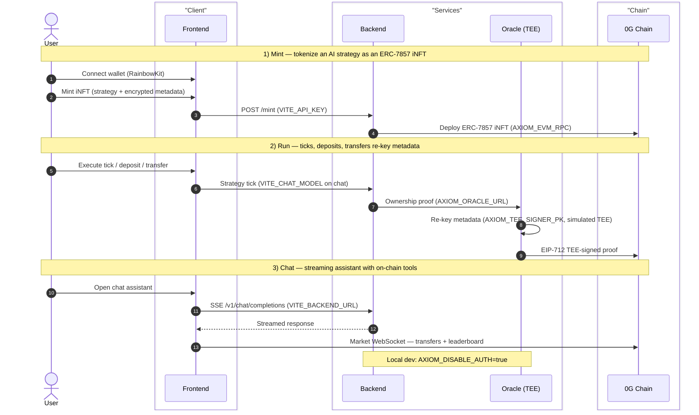

<p align="center">
  
</p>

<p align="center">
  ERC-7857 Agentic ID iNFTs on <a href="https://0g.ai">0G</a> — trade on 0G Chain, run via 0G Compute, store on 0G Storage.
</p>

<p align="center">
  <a href="https://opensource.org/licenses/MIT"></a>
</p>

---

## Overview

Axiom Protocol turns an AI strategy into an **ERC-7857 Intelligent NFT (iNFT)**: an ownable,
transferable on-chain asset whose encrypted metadata is re-keyed on every transfer by a
**TEE-style signer** (simulated TEE today — a Node signer with a cleartext key, not Intel TDX/SEV).
Agents run vaults, execute strategy ticks, and trade on a live 0G Chain market.

## 0G Integration

Axiom Protocol is built on 0G's modular stack:

- **0G Chain** — ERC-7857 iNFT contracts (AgentNFT, StrategyVault, TeeVerifier, PaymentProcessor, MockUSDC) deployed and executed on 0G Chain.
- **0G Compute** — AI strategy inference and the TEE-style signer that re-keys encrypted metadata on every transfer.
- **0G Storage** — encrypted iNFT payloads uploaded to 0G Storage; the Merkle dataHash is registered on-chain.

## Architecture

The iNFT lifecycle flows through the monorepo — `apps/{contracts,backend,oracle,frontend,indexer}`, `packages/{config,chat-runtime}` — and the TEE signer re-keys encrypted metadata on every transfer. Env vars are noted where each service reads them.



## Prerequisites

- Node ≥ 22 (Railway pins 22, Vercel uses 24.x), pnpm 10.22.0, Foundry (`forge`) for contracts.

## Quick start (local)

```bash
pnpm install
cp .env.example .env                # canonical template; fill in deployed addresses + secrets
pnpm --filter @axiom/config build
pnpm --filter @axiom/chat-runtime build   # required before backend/oracle dev
pnpm --filter @axiom/oracle dev            # :8787
pnpm --filter @axiom/backend dev           # :3000
pnpm --filter @axiom/frontend dev          # :5173
```

Contracts: `cd apps/contracts && pnpm build && pnpm test`

## Deploy

Two platforms, deployed in order so the frontend is wired to the live backend.

**1. Railway — backend, oracle, indexer.** Each service has its own `railway.json`
(`apps/backend`, `apps/oracle`, `apps/indexer`) with build
(`pnpm --filter @axiom/config build && pnpm --filter @axiom/<svc> build`), start
(`node apps/<svc>/dist/index.js`), `/health` healthcheck, and `ON_FAILURE` restart. A root
`nixpacks.toml` pins Node 22 + pnpm, installs with `--frozen-lockfile`, and caches `dist`
outputs. (The old root `railway.json` and `scripts/railway-*.sh` were removed — configuration is
now per-service config-as-code.) Connect each service to its folder in the Railway dashboard, or
`railway up` per service.

**2. Vercel — frontend.** Root `vercel.json` builds `@axiom/config` + `@axiom/frontend` to
`apps/frontend/dist`, sets the SPA rewrite and a CSP that allows Google Fonts. Before deploying,
set these **Production** env vars in the Vercel project: `VITE_BACKEND_URL` → your Railway backend
URL, `VITE_ORACLE_URL` → your Railway oracle URL, `VITE_CHAT_MODEL` → `qwen/qwen2.5-omni-7b`. Then
`vercel --prod --yes` from repo root.

**Wiring order:** Railway first (exposes the URLs) → set the Vercel env vars → Vercel deploy. The
bundle is built against those URLs, so the frontend never calls localhost in prod. Note: the Vercel
project is CLI-deployed with no connected Git repo, so Preview/Development env vars must be added in
the dashboard; Railway auto-deploy is off until enabled in its dashboard.

## Docs & links

- `docs/README.md` — architecture, security, API.
- `docs/env-vars.md` — full environment-variable table.
- [0G Bridge by AKINDO](https://app.akindo.io/wave-hacks/xKOgjd91kCmrN3ORz/) · https://github.com/symulacr/axiom-protocol
