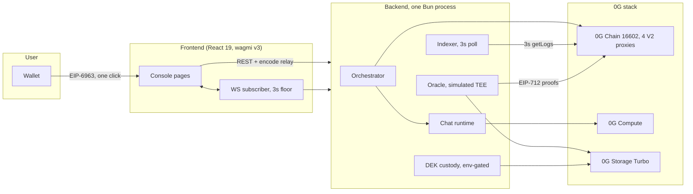
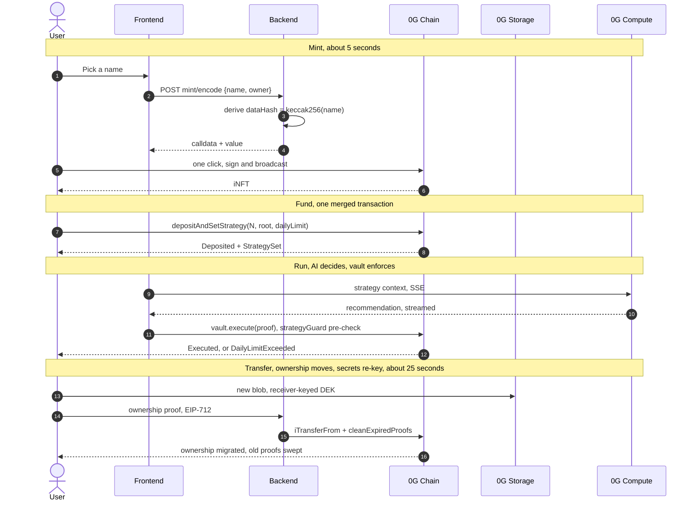
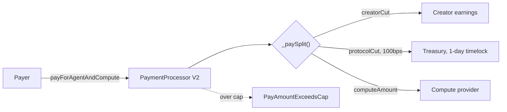
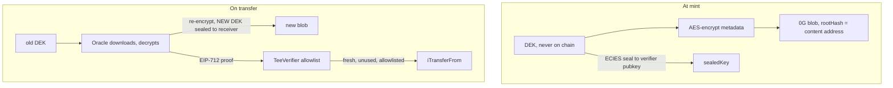

<p align="center">
  
</p>

<p align="center">
  ERC-7857 Agentic ID iNFTs on <a href="https://0g.ai">0G</a>: trade on 0G Chain, run via 0G Compute, store on 0G Storage. · <a href="https://opensource.org/licenses/MIT"></a>
</p>

## What this is

Axiom Protocol turns a trading strategy into an **ERC-7857 Intelligent NFT (iNFT)** on 0G:
an ownable, transferable asset whose encrypted metadata is re-keyed on every transfer by a
TEE-style signer. Agents hold vaults with daily spend limits, run AI ticks through 0G
Compute, and pay their creators from a single on-chain split. When you sell an agent, the
buyer gets the secrets re-keyed to their wallet and you get paid. The old owner's access is
swept.

The TEE signer is simulated today: a software secp256k1 signer with a cleartext key, not
Intel TDX/SEV hardware. Everything else (sealed key transport, one-shot proof nonces,
7-day freshness, signer allowlist) is built as if the hardware were real, so the swap is a
deployment change, not a rewrite.

State: **V2 contracts live on 0G Galileo testnet** (fresh deploy 2026-08-28, all wiring
asserted on-chain). 599 tests green across five suites, zero lint suppressions.

## Monorepo layout

| Path | What lives there |
| --- | --- |
| `apps/backend` | Bun + Express. Orchestrator, in-process oracle + indexer, chat, WS events |
| `apps/frontend` | Bun + React 19 + wagmi v3. Console for the flows above |
| `apps/contracts` | Foundry Solidity. AgentNFT, StrategyVault, PaymentProcessor, TeeVerifier |
| `packages/config` | Shared chains, ABIs, env schema, 0G Storage SDK wiring |
| `packages/chat-runtime` | Tool-calling chat engine used by the backend |
| `docs/adr` | ADR 002 (DA rejection), 003 (keeper options), 004 (V2 rewrite plan) |
| `docs/deployments` | Deployment records; `galileo-v2-2026-08-28.json` is current |

## Architecture

One backend process hosts the oracle, indexer, orchestrator, and chat runtime. No
cross-service hops. The frontend never touches the chain except through wagmi for user
signatures; data flows through the backend, which fans out to the three 0G services.



### User journey



### Payment split (one canonical path)



### Trust: the re-key dance



The chain sees hashes and sealed keys only. The verifier signer allowlist (V2) means a
leaked TEE key is revoked in one transaction. The storage canary (AXIOM1 magic prefix)
makes silent wrong-key ciphertext downloads impossible; AES-CTR has no built-in auth.

## What V2 changed

Fresh deploy per [ADR 004](docs/adr/004-contract-rewrite-plan.md). Every item below is a
closed audit finding, proven by test.

| Surface | Before | Now |
| --- | --- | --- |
| Fee withdrawal + upgrades | instant, single admin key | 1-day timelock, propose/execute/cancel |
| Payment splits | three divergent copies | one `_paySplit()`, wrappers only |
| Pay bound | app-level caps only | `MAX_PAY` chain invariant, reverts on-chain |
| Verifier signer | single key, compromise forges transfers for a day | allowlist, revoke in one tx |
| Payment governance | Ownable | AccessControl, matching the NFT |
| Dead surfaces | `authorizeDelegateAndRevoke`, `OPERATOR_ROLE`, `payAndWithdrawEarnings` | removed |
| Strategy invariants | hand-mirrored Solidity ↔ TS, drifted silently | 12-case machine-pinned parity test |

## Guarantees, proven on the live chain

Every invalid path was driven against the deployed V2 contracts and asserts the exact
revert. This is the failure matrix, not a wish list.

| Failure | On-chain result | Proof |
| --- | --- | --- |
| Execute over daily limit | `DailyLimitExceeded()` | e2e + 12 chain-parity tests |
| Pay over MAX_PAY | `PayAmountExceedsCap(amount, cap)` | live tx on V2 |
| Stale proof replay | `AxiomProofExpired()` | e2e, exact selector |
| Compromised signer forges transfer | revoke in one tx blocks it | verifier allowlist tests |
| Rogue admin upgrades or drains | blocked 1 day by timelock | NFT timelock tests |
| Wrong-key blob download | typed `WrongKeyOrCorruptError`, canary | storage tests |
| 0G RPC outage | wagmi + ethers degrade to dRPC/Ankr | live-proven, dual-endpoint abort |

## Quick start

Requires **Bun ≥ 1.4** (`packageManager: bun@1.4.0`) and Foundry (`forge`) for contracts.

```bash
bun install
cp .env.example .env                  # fill in deployed addresses + API keys
bun run --filter @axiom/config build
bun run --filter @axiom/chat-runtime build   # required before backend dev
bun run --filter @axiom/backend dev          # :3000 (in-process oracle + indexer)
bun run --filter @axiom/frontend dev         # :5173
```

```bash
bun run build          # config + chat-runtime + backend
bun run build:all      # + frontend
bun run test           # all workspaces
bun run typecheck      # all workspaces
bun run lint           # backend + frontend
```

Contracts: `cd apps/contracts && forge build && forge test`
(CI deps: `bash scripts/ci-forge-install.sh`; ABI drift gate: `bash scripts/check-abi-drift.sh`).

## Chain + current deployment

Chain is env-driven: `AXIOM_CHAIN_ID` / `VITE_CHAIN_ID`, defaulting to **0G Galileo testnet
(16602)**. Set `16661` for Aristotle mainnet.

Current deployment is the **V2 suite on Galileo**, fresh deploy 2026-08-28
([docs/deployments/galileo-v2-2026-08-28.json](docs/deployments/galileo-v2-2026-08-28.json)).
All wiring assertions passed on-chain (`nft.verifier()`, `vault.nft()`,
`processor.AXIOM_NFT()`, payment token match, signer allowlisted, MINTER granted).

| Contract | Proxy | V2 changes |
| --------- | ---------------- | --- |
| AxiomAgentNFT | `0xdBB2e63807a13272789B716692fbe0d09E010097` | fee/upgrade timelocks, dead surfaces removed |
| AxiomStrategyVault | `0x4607D749a7b8BBD2593742F8432410231C805c57` | unchanged, non-upgradeable by design |
| AxiomPaymentProcessor | `0x7490D693364A31E0513bcef8E346397cc4BA9E9c` | MAX_PAY, AccessControl, single `_split` |
| AxiomTeeVerifier | `0x72a381226E09b9AAe15D9309A656d7e5DD2bFbb2` | signer allowlist, same-block revoke |
| MockUSDC (payment token) | `0x354CA53bAB51C0666964fa050628d8351f8A7d19` | unchanged |

The older records ([merged 2026-08-13](docs/deployments/galileo-merged-2026-08-13.json),
[Aristotle 2026-07-22](docs/deployments/aristotle-2026-07-22.json)) are superseded and do
not match current contract source.

## Deployment

- **Railway** (`railway.json`, two services):
  - `axiom-backend`, built by `bun scripts/build-binaries.mjs` into a standalone binary, started as `./dist/axiom-backend` (health: `/health`).
  - `axiom-frontend`, static build + `bun apps/frontend/server.mjs`.
- **Vercel** (`vercel.json`), static SPA from `apps/frontend/dist`, rewriting `/api/*` and `/oracle/*` to the Railway backend.
- Mainnet cutover plan: ADR 004 §4 (upgrade-in-place or scripted migration, never a fresh deploy).

## Security posture (honest)

- Auth is **API-key based**: `AXIOM_API_KEY` (server, full access) and
  `AXIOM_CLIENT_API_KEY` / `VITE_API_KEY` (browser, hard allowlist, no vault execute).
  `AXIOM_DISABLE_AUTH=true` is refused when `NODE_ENV=production`.
- The TEE signer is **simulated**: a software secp256k1 signer holding a cleartext key.
  It is not a hardware TEE. Transfers require an ECIES-**sealed** data-encryption key;
  cleartext DEKs are rejected.
- **Signer allowlist** (V2): revocation is immediate, adding a signer keeps the 1-day
  timelock. A compromised key is contained in one block instead of one day.
- Production deploy keys live only in git-ignored local files or env vars, never in the
  repo. Rotate testnet keys before mainnet.
- **Known gaps, stated plainly:** the DEK custody store is a JSON file (fine for testnet,
  needs a real store for mainnet); the keeper's Chainlink/Gelato modes are documented
  stubs; the strategy-invariant TS mirror is machine-pinned against current Solidity and
  must be re-pinned after any vault change.

## Testing

599 tests, zero suppressions.

| Suite | Count | Notes |
| --- | --- | --- |
| Foundry (contracts) | 201 | incl. fuzz; storage-layout append-only enforced |
| Backend (Bun) | 175 | incl. e2e Live Path Gate 43/43 + 11-scenario failure matrix on live V2 |
| Frontend (Bun) | 112 | incl. ChatPage guards, contrast, i18n contract |
| Chat runtime | 64 | tool-calling executors |
| Shared config | 47 | incl. 12-case Solidity↔TS strategy-guard parity |

## Further docs

- [ADR 004, V2 rewrite plan and redeploy checklist](docs/adr/004-contract-rewrite-plan.md)
- [ADR 003, proof-cleanup keeper options](docs/adr/003-proof-cleanup-keeper-options.md)
- [Diagram pack (mermaid) + logic tables](docs/hackathon/)
- [One-pager (HTML)](docs/hackathon/axiom-onepager.html)
- [Full change log, all 689 commits](docs/hackathon/CHANGELOG-full-688.md)
