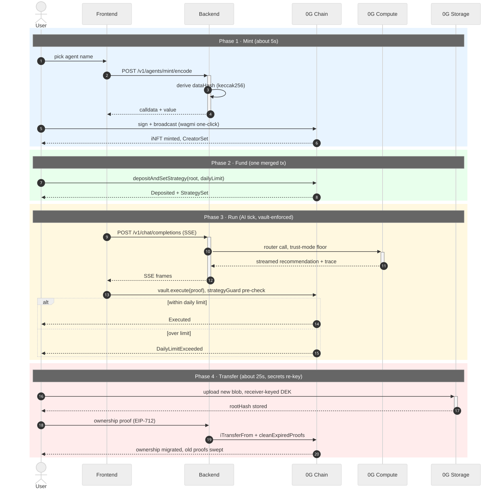

<p align="center">
  
</p>

<p align="center">
  ERC-7857 Agentic ID iNFTs on <a href="https://0g.ai">0g.ai</a>: trade on 0G Chain, run via 0G Compute, store on 0G Storage. · <a href="https://opensource.org/licenses/MIT"></a>
</p>

## What this is

Axiom Protocol turns a trading strategy into an **ERC-7857 Intelligent NFT (iNFT)** on 0G:
an ownable, transferable asset whose encrypted metadata is re-keyed on every transfer.
Agents hold vaults with daily spend limits, run AI ticks through 0G Compute, and pay their
creators from a single on-chain split. V3 is live on Aristotle mainnet; Galileo testnet is
the dev lane.

## Monorepo layout

| Path | What lives there |
| --- | --- |
| `apps/backend` | Bun + Express. Orchestrator, in-process oracle + indexer, chat, WS events |
| `apps/frontend` | Bun + React 19 + wagmi v3. Console for the flows above |
| `apps/contracts` | Foundry Solidity. AgentNFT, StrategyVault, PaymentProcessor, TeeVerifier |
| `packages/config` | Shared chains, ABIs, env schema, 0G Storage SDK wiring |
| `packages/chat-runtime` | Tool-calling chat engine used by the backend |

## Architecture

One backend process hosts the oracle, indexer, orchestrator, and chat runtime. The
agent lifecycle in four numbered stages (pre-rendered SVG — displays in any viewer;
text-ladder and mermaid versions live in the
[architecture walkthrough](docs/architecture-walkthrough.md#agent-lifecycle-sequence-mermaid)):



Request lifecycle, journey, payment split, re-key flow: [architecture walkthrough](docs/architecture-walkthrough.md).

## Networks

**Mainnet (Aristotle 16661) is the default; Galileo testnet (16602) is the dev lane.**
Select via `AXIOM_CHAIN_ID` / `VITE_CHAIN_ID`; the deployer targets both via
`forge script script/Deploy.s.sol --rpc-url <url>`. Addresses live only in the records:

| Network | Record | Status |
| --- | --- | --- |
| Aristotle mainnet 16661 | [aristotle-v3-2026-09-01.json](docs/deployments/aristotle-v3-2026-09-01.json) | V3 live (2026-09-01) |
| Galileo testnet 16602 | [galileo-v3-2026-08-31.json](docs/deployments/galileo-v3-2026-08-31.json) | V3 dev lane (2026-08-31) |

Hosting: **Railway** (`railway.json`: `axiom-backend` standalone binary + `axiom-frontend`)
and **Vercel** (`vercel.json`: static SPA rewriting `/api/*` and `/oracle/*` to Railway).

## Quick start

Requires **Bun ≥ 1.4** and Foundry (`forge`) for contracts.

```bash
bun install
cp .env.example .env                  # fill in deployed addresses + API keys
bun run --filter @axiom/config build
bun run --filter @axiom/chat-runtime build   # required before backend dev
bun run --filter @axiom/backend dev          # :3000 (in-process oracle + indexer)
bun run --filter @axiom/frontend dev         # :5173
```

Repo-wide: `bun run build | build:all | test | typecheck | lint`. Contracts: `cd apps/contracts && forge build && forge test`.

## Testing

Test suites are **local-only** (not versioned): `bun test` per workspace, `forge test` in
`apps/contracts`, plus the backend e2e Live Path Gate. CI runs the runtime gates only:
typecheck, frontend build, contract compile, secret scan. V2-era guarantee tables:
[history](docs/history.md).

## Security posture

Auth is **API-key based** (server full access; browser hard-allowlisted). The TEE signer is
**simulated** while transports use sealed DEKs exactly as the hardware version would.
Full posture, key hygiene, known gaps: [docs/security.md](docs/security.md).

## Agent mode (poteto-mode)

AI agents working in this repo follow the
[Poteto Mode skill](https://github.com/cursor/plugins/blob/main/pstack/skills/poteto-mode/SKILL.md).
In short: principles before playbooks; the laziness protocol (the best code is no code —
drop non-fixes, fix bugs at the root, cut scope creep in review); decisions carry citations
both ways between principles and PR changes; reversible work proceeds while irreversible
work pauses for confirmation; subagents verify with evidence, read less, understand more;
replies are short declarative sentences with no hedging.

## Further docs

- [Security posture + known gaps](docs/security.md)
- [Architecture walkthrough (journey, payment split, re-key)](docs/architecture-walkthrough.md)
- [Project history (V2 changes, live-chain guarantees)](docs/history.md)
- [ERC-7857 divergence register](docs/erc7857-divergences.md)
- [ADR 004, V2 rewrite plan and redeploy checklist](docs/adr/004-contract-rewrite-plan.md)
- [ADR 003, proof-cleanup keeper options](docs/adr/003-proof-cleanup-keeper-options.md)
- [Diagram pack (mermaid) + logic tables](docs/hackathon/)
- [One-pager (HTML)](docs/hackathon/axiom-onepager.html)
- [Full change log, all 689 commits](docs/hackathon/CHANGELOG-full-688.md)
