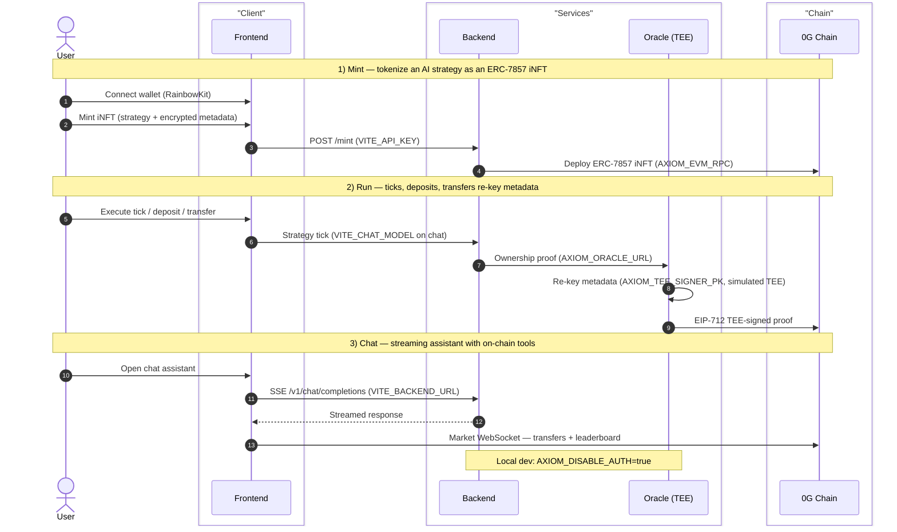

<p align="center">
  
</p>

<p align="center">
  ERC-7857 Agentic ID iNFTs on <a href="https://0g.ai">0G</a> — trade on 0G Chain, run via 0G Compute, store on 0G Storage.
</p>

<p align="center">
  <a href="https://opensource.org/licenses/MIT"></a>
</p>

---

## Overview

Axiom Protocol turns an AI strategy into an **ERC-7857 Intelligent NFT (iNFT)**: an ownable,
transferable on-chain asset whose encrypted metadata is re-keyed on every transfer by a
**TEE-style signer** (simulated TEE today — a Node signer with a cleartext key, not Intel TDX/SEV).
Agents run vaults, execute strategy ticks, and trade on a live 0G Chain market.

## 0G Integration

Axiom Protocol is built on 0G's modular stack:

- **0G Chain** — ERC-7857 iNFT contracts (AgentNFT, StrategyVault, TeeVerifier, PaymentProcessor, MockUSDC) deployed and executed on 0G Chain.
- **0G Compute** — AI strategy inference and the TEE-style signer that re-keys encrypted metadata on every transfer.
- **0G Storage** — encrypted iNFT payloads uploaded to 0G Storage; the Merkle dataHash is registered on-chain.

## Architecture

The iNFT lifecycle flows through the monorepo — `apps/{contracts,backend,oracle,frontend,indexer}`, `packages/{config,chat-runtime}` — and the TEE signer re-keys encrypted metadata on every transfer. Env vars are noted where each service reads them.



## Prerequisites

- Node ≥ 22 (Railway pins 22, Vercel uses 24.x), pnpm 10.22.0, Foundry (`forge`) for contracts.

## Quick start (local)

```bash
pnpm install
cp .env.example .env                # canonical template; fill in deployed addresses + secrets
pnpm --filter @axiom/config build
pnpm --filter @axiom/chat-runtime build   # required before backend/oracle dev
pnpm --filter @axiom/oracle dev                       # :8787
pnpm --filter @axiom/backend dev                      # :3000 (includes indexer)
pnpm --filter @axiom/frontend dev                     # :5173
```

Contracts: `cd apps/contracts && pnpm build && pnpm test`

## Deployment

### Live URLs

| Service | URL |
|---------|-----|
| Backend API | `https://axiom-backend-production-2cf5.up.railway.app` |
| Oracle (TEE signer) | `https://oracle-production-9f7d.up.railway.app` |
| Frontend | `https://axiom-protocol.vercel.app` |

### Contracts (Aristotle mainnet, chain 16661)

| Contract | Address | Explorer |
|----------|---------|---------|
| AxiomTeeVerifier (proxy) | `0x7490D693364A31E0513bcef8E346397cc4BA9E9c` | [chainscan](https://chainscan.0g.ai/address/0x7490D693364A31E0513bcef8E346397cc4BA9E9c) |
| AxiomAgentNFT (proxy) | `0x4938F10B12051CE8DCd70E3F7555E71adb432545` | [chainscan](https://chainscan.0g.ai/address/0x4938F10B12051CE8DCd70E3F7555E71adb432545) |
| AxiomStrategyVault (proxy) | `0xe32f87C6F8070C89a82D51BDd3fab578C0d7be6f` | [chainscan](https://chainscan.0g.ai/address/0xe32f87C6F8070C89a82D51BDd3fab578C0d7be6f) |
| AxiomPaymentProcessor (proxy) | `0xe8B3B31E5CE0436cCfD19a47351943CcB7703722` | [chainscan](https://chainscan.0g.ai/address/0xe8B3B31E5CE0436cCfD19a47351943CcB7703722) |
| MockUSDC (payment token) | `0x354CA53bAB51C0666964fa050628d8351f8A7d19` | — |

All 8 contracts (impl + proxy for each) verified on chainscan.

