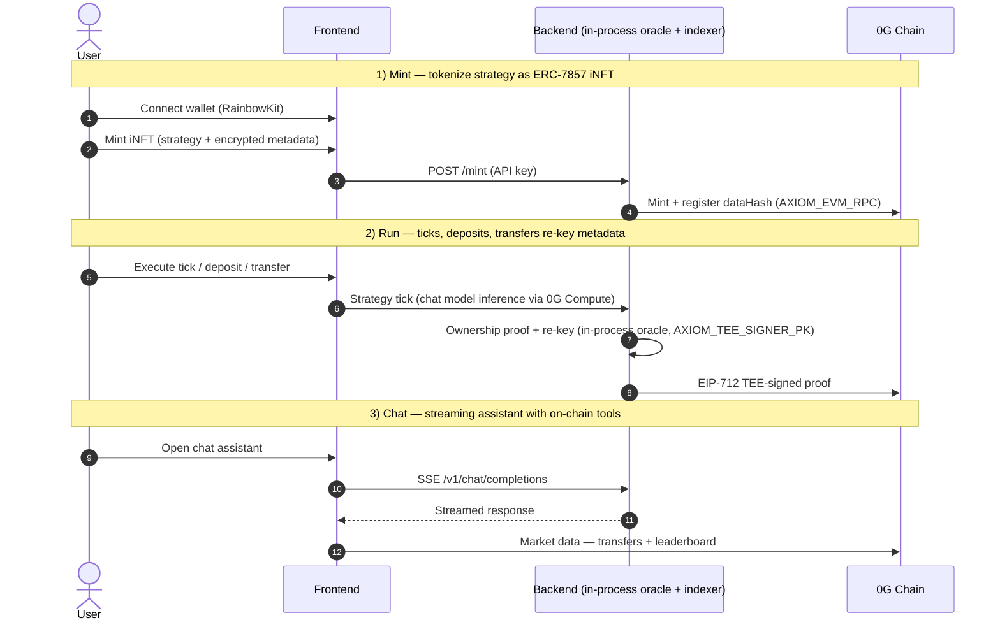

<p align="center">
  
</p>

<p align="center">
  ERC-7857 Agentic ID iNFTs on <a href="https://0g.ai">0G</a> — trade on 0G Chain, run via 0G Compute, store on 0G Storage. · <a href="https://opensource.org/licenses/MIT"></a>
</p>

## Overview

Axiom Protocol turns an AI strategy into an **ERC-7857 Intelligent NFT (iNFT)**: an ownable,
transferable on-chain asset whose encrypted metadata is re-keyed on every transfer by a
**TEE-style signer** (simulated TEE today — Node signer with cleartext key, not Intel TDX/SEV).
Agents run vaults, execute strategy ticks, and trade on a live 0G Chain market.

**One backend service.** The oracle (TEE signer, `src/oracle/`) and the chain indexer
(`src/indexer/`) run **in-process** inside `apps/backend` — there are no separate
oracle/indexer services or ports. Oracle routes are mounted under `/oracle/*` on the
backend's own HTTP server.

## Monorepo layout

```text
apps/backend     Bun + Express API: orchestrator, in-process oracle + indexer, chat, WS events
apps/frontend    Bun + React 18 + wagmi v2 + RainbowKit dashboard (Bun-native dev/build, no Vite)
apps/contracts   Foundry Solidity: AxiomAgentNFT (ERC-7857), StrategyVault, PaymentProcessor, TeeVerifier
apps/bench       Live E2E benchmark harness (local-only, not tracked)
packages/config  Shared chains, ABIs, env schema, 0G Storage SDK wiring
packages/chat-runtime  Tool-calling chat engine used by backend
scripts/         CI + deploy tooling (forge install, ABI drift check, mainnet deploy, wallets)
```

## Architecture



## Quick start

Requires **Bun ≥ 1.4** (`packageManager: bun@1.4.0`) and Foundry (`forge`) for contracts.

```bash
bun install
cp .env.example .env                  # fill in deployed addresses + API keys
bun run --filter @axiom/config build
bun run --filter @axiom/chat-runtime build   # required before backend dev
bun run --filter @axiom/backend dev          # :3000 (in-process oracle + indexer)
bun run --filter @axiom/frontend dev         # :5173
```

```bash
bun run build          # config + chat-runtime + backend
bun run build:all      # + frontend
bun run test           # all workspaces
bun run typecheck      # all workspaces
bun run lint           # backend + frontend
```

Contracts: `cd apps/contracts && forge build && forge test`
(CI deps: `bash scripts/ci-forge-install.sh`; ABI drift gate: `bash scripts/check-abi-drift.sh`).

## Chain + current deployment

Chain is env-driven: `AXIOM_CHAIN_ID` / `VITE_CHAIN_ID`, defaulting to **0G Galileo testnet
(16602)**. Set `16661` for Aristotle mainnet.

The current deployed prototype is the **tx-merge build on Galileo** —
[docs/deployments/galileo-merged-2026-08-13.json](docs/deployments/galileo-merged-2026-08-13.json)
(5 merged tx functions, e2e flow 12 → 6 on-chain txs):

| Contract | Address (proxy) |
| --------- | ---------------- |
| AxiomAgentNFT | `0x4e57e954D82A99Ee94c48e1bc804bA9D131a3622` |
| AxiomStrategyVault | `0x4D0A123fbb83F7a5f137ec0B720a5D69fCB52251` |
| AxiomPaymentProcessor | `0x9cDeDd99fe5F2E25f30920e092fC1C586716c0eC` |
| AxiomTeeVerifier (reused) | `0x1ba37125bba23b66b549ccb33bc9b4952fd4dcc4` |
| MockUSDC (payment token) | `0x354CA53bAB51C0666964fa050628d8351f8A7d19` |

The older Aristotle mainnet record
([2026-07-22](docs/deployments/aristotle-2026-07-22.json)) is **stale** — it predates the
merged transaction functions and does not match current contract source.

## Deployment

- **Railway** (`railway.json`, two services):
  - `axiom-backend` — built by `bun scripts/build-binaries.mjs` into a standalone binary, started as `./dist/axiom-backend` (health: `/health`).
  - `axiom-frontend` — static build + `bun apps/frontend/server.mjs`.
- **Vercel** (`vercel.json`) — static SPA from `apps/frontend/dist`, rewriting `/api/*` and `/oracle/*` to the Railway backend.

## Security posture (honest)

- Auth is **API-key based**: `AXIOM_API_KEY` (server, full access) and
  `AXIOM_CLIENT_API_KEY` / `VITE_API_KEY` (browser, hard allowlist — no vault execute).
  `AXIOM_DISABLE_AUTH=true` is refused when `NODE_ENV=production`.
- The TEE signer is **simulated**: a software secp256k1 signer holding a cleartext key.
  It is not a hardware TEE. Transfers require an ECIES-**sealed** data-encryption key;
  cleartext DEKs are rejected.
- Production deploy keys live in `wallets/*.json` (git-ignored) or env vars — never in the repo.
