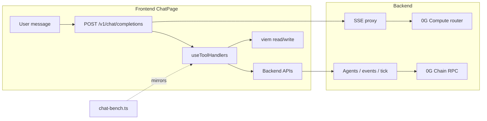

# Axiom Coverage Week Plan

**Window:** Mon 6 Jul – Sun 12 Jul 2026 (7 days)  
**Goal:** Close E2E, load bench, and chat bench gaps; wire CI gates; ship a defensible coverage story for frontend ↔ backend ↔ contract ↔ 0G Compute.

**Live tracking**

| Artifact | Purpose |
|----------|---------|
| [`.coverage/manifest.json`](.coverage/manifest.json) | Source of truth — tasks, gates, blockers, state |
| [`COVERAGE-TODO.md`](COVERAGE-TODO.md) | Human checklist (mirror of manifest) |
| `pnpm run coverage-status` | Dashboard on the go |
| `pnpm run coverage-status -- done T-001` | Mark task complete |

---

## Success criteria (end of week)

| Gate | Target |
|------|--------|
| E2E REUSE wall time | ≤ 50s (with chat bench off) / ≤ 90s (with chat bench on) |
| Load bench | 100% reliability at c=1/5/10/20 on all 8 lanes |
| Chat tool parity | 100% (11 tools incl. archive) without live compute |
| Chat eval (live) | ≥ 90% with `AXIOM_RATE_LIMIT_MAX=50000` |
| Production eval | ≥ 85% on full E2E (REUSE or full) |
| CI | PR job: tool-parity chat bench; nightly: REUSE E2E + load bench |
| Docs | E2E-DISCOVERIES through D-035; this plan marked complete |

---

## Current baseline

| Area | Status |
|------|--------|
| E2E fast paths (KEEP/REUSE/mega) | Working (~40–78s) |
| Load bench (8 lanes × c=1/5/10/20) | 100% after health cache fix |
| Chat tool parity (8 tools + complex flow) | 100% |
| Live SSE (keep-alive, tools) | Works when rate limit allows |
| Context growth / model switch | Blocked by 429 at default 10 req/min |
| Chat eval | 85–93% depending on live-compute mode |

**Blockers to clear first:** backend rate limit, operator MockUSDC balance, live compute API key.

---

## Coverage matrix (what “done” means)

| Layer | Surface | Bench / E2E ID | Done when |
|-------|---------|----------------|-----------|
| Contract | mint, deposit, vault, transfer | `agent.mint`, `vault.*`, `transfer.*` | Full or REUSE E2E green |
| Backend HTTP | health, routes, events, stream | `api.*`, `events.*` | Load bench + E2E green |
| Backend cache | providers, payment config, agents | `compute.providers`, `payment.config-cache`, `chat.cache-hit` | Δms logged; warm &lt; 300ms |
| 0G Compute | tick live, chat SSE, tools | `orchestrator.tick-live`, `compute.chat-tools` | Live bench green |
| Frontend chat | 8 core + 3 archive tools | `chat.tools-*` | Parity 100% in `chat-bench.ts` |
| Frontend chat live | multi-turn, model switch | `chat.context-growth`, `chat.model-switch`, `chat.keepalive` | Live bench green (no 429) |
| Write tools | mint/deposit/withdraw | `chat.tools-write` + friction doc | Encode routes or wizard spec’d |

---

## Environment checklist

Run before any live bench or full E2E:

```bash
# Terminal 1 — oracle
cd apps/oracle && node --import tsx src/index.ts

# Terminal 2 — backend (high rate limit for bench)
cd apps/backend
AXIOM_RATE_LIMIT_MAX=50000 \
AXIOM_HEALTH_CACHE_MS=3000 \
node --import tsx src/index.ts
```

Required env (see `.env` / `E2E-DISCOVERIES.md`):

- `AXIOM_COMPUTE_DIRECT_KEY` or working `OG_COMPUTE_API_KEY` (401 = skip live compute)
- `E2E_OPERATOR_PK` + funded native OG
- MockUSDC ≥ 0.02 USDC on operator for payment scenarios
- `apps/backend/.data/e2e-last.json` for REUSE (`tokenId` etc.)

---

## Day-by-day schedule

### Day 1 — Mon 6 Jul — Unblock live chat (Phase 1)

**Theme:** Rate limit + green live chat bench.

| # | Task | Owner | Effort | Acceptance |
|---|------|-------|--------|------------|
| 1.1 | Restart backend with `AXIOM_RATE_LIMIT_MAX=50000` | — | 15m | `curl /health` 200 |
| 1.2 | Optional: per-route limit for `/v1/chat/completions` in `server.ts` | — | 1h | Chat route ≥ 60/min independent of global |
| 1.3 | Run live chat bench | — | 30m | All `chat.*` rows OK |
| 1.4 | Capture report in terminal log / paste to discoveries | — | 15m | D-031 updated |

```bash
cd apps/backend
E2E_LIVE_COMPUTE=1 CHAT_BENCH_TOKEN_ID=34 \
  CHAT_BENCH_CONTEXT_ROUNDS=2 CHAT_BENCH_KEEPALIVE_ROUNDS=2 \
  node --import tsx src/cli/run-chat-bench.ts
```

**Exit:** Context growth + model switch green; chat eval ≥ 90%.

---

### Day 2 — Tue 7 Jul — E2E integration + REUSE parity (Phase 1 cont.)

**Theme:** Full pipeline with chat bench at end of E2E.

| # | Task | Effort | Acceptance |
|---|------|--------|------------|
| 2.1 | `E2E_REUSE_TOKEN=1 E2E_LIVE_COMPUTE=1` full E2E | 1h | Exit 0; parity ≥ 75% |
| 2.2 | Record wall time with / without `E2E_CHAT_BENCH=0` | 30m | Table in discoveries D-033 |
| 2.3 | Fund operator MockUSDC if payment skipped | 30m | `payment.*` scenarios covered |
| 2.4 | `E2E_KEEP_TOKEN=1` snapshot refresh | 15m | `.data/e2e-last.json` updated |

```bash
# Fast regression (no transfer)
E2E_REUSE_TOKEN=1 E2E_LIVE_COMPUTE=1 node --import tsx src/cli/run-e2e.ts

# Compare chat cost
E2E_REUSE_TOKEN=1 E2E_CHAT_BENCH=0 node --import tsx src/cli/run-e2e.ts
```

**Exit:** REUSE + live compute + chat eval documented; payment path unskipped if funded.

---

### Day 3 — Wed 8 Jul — Archive tools + npm scripts (Phase 2 + 4)

**Theme:** Complete frontend tool parity; developer ergonomics.

| # | Task | Effort | Acceptance |
|---|------|--------|------------|
| 3.1 | Add `archive_lookup`, `archive_account_tweets`, `archive_confirm_deletion` to `chat-bench.ts` | 1h | 11/11 tools OK |
| 3.2 | Add `pnpm` scripts in `apps/backend/package.json` | 30m | See commands below |
| 3.3 | Tool parity only in CI-friendly mode | 15m | `E2E_LIVE_COMPUTE=0` exit 0 |

```json
"scripts": {
  "run-chat-bench": "node --import tsx src/cli/run-chat-bench.ts",
  "run-chat-bench:live": "E2E_LIVE_COMPUTE=1 node --import tsx src/cli/run-chat-bench.ts",
  "run-load-bench": "node --import tsx src/cli/run-load-bench.ts"
}
```

**Exit:** `pnpm run run-chat-bench` passes in &lt; 20s; archive tools covered.

---

### Day 4 — Thu 9 Jul — CI gates + nightly (Phase 4)

**Theme:** Automate what we proved manually.

| # | Task | Effort | Acceptance |
|---|------|--------|------------|
| 4.1 | GitHub Actions (or existing CI) job: `chat-bench` tool parity | 2h | PR check required |
| 4.2 | Nightly workflow: REUSE E2E + load bench | 2h | Scheduled; artifacts uploaded |
| 4.3 | Nightly optional: live chat bench (secrets for compute key) | 1h | Non-blocking or `continue-on-error` |
| 4.4 | Document secrets in README or `E2E-DISCOVERIES.md` | 30m | `AXIOM_COMPUTE_DIRECT_KEY`, rate limit |

**PR job (minimal):**

```yaml
- run: pnpm --filter @axiom/backend run run-chat-bench
  env:
    E2E_LIVE_COMPUTE: "0"
    BACKEND_URL: http://127.0.0.1:3000
```

**Exit:** CI green on PR; nightly runs without manual backend start (or uses service container).

---

### Day 5 — Fri 10 Jul — Write tools + agent list perf (Phase 2)

**Theme:** Close frontend ↔ contract friction for chat write paths.

| # | Task | Effort | Acceptance |
|---|------|--------|------------|
| 5.1 | **Pick one write-tool strategy** (see options below) | — | Decision recorded in D-034 |
| 5.2 | Implement chosen path | 4–8h | E2E or bench proves encode/sign |
| 5.3 | Agent list cold path (~10s) — TTL bump or index note | 2h | `list_my_agents` &lt; 3s warm, &lt; 5s cold target |

**Write-tool options (choose one for the week):**

| Option | Scope | Effort | Best if |
|--------|-------|--------|---------|
| **A** Guided mint wizard (upload → oracle → mint) | Frontend | 2d | UX is priority |
| **B** Backend `POST /v1/agents/:id/deposit|withdraw` encode | Backend | 1d | Chat tools stay API-driven |
| **C** E2E only: operator signs after encode in `chat-bench.ts` | E2E | 0.5d | Coverage proof only |

**Recommended for one week:** **B + C** — backend encode routes for deposit/withdraw; E2E signs with operator wallet for one deposit micro-tx.

**Exit:** `chat.tools-write` uses real encode endpoints; friction `ui-mint-skips-storage` has mitigation plan.

---

### Day 6 — Sat 11 Jul — Hardening + observability (Phase 3)

**Theme:** Production-shaped probes; optional load chat lane.

| # | Task | Effort | Acceptance |
|---|------|--------|------------|
| 6.1 | `/health/live` vs `/health` readiness split | 3h | Load bench can target live only |
| 6.2 | Connection reuse: document or `http.Agent` experiment | 2h | Note in discoveries (pooling vs explicit agent) |
| 6.3 | Load bench `chat-smoke` lane (c=1 only, 1 SSE ping) | 2h | Lane passes; not run at c&gt;1 |
| 6.4 | Re-run full load bench after changes | 30m | 100% all concurrencies |

```bash
pnpm --filter @axiom/backend run run-load-bench
```

**Exit:** Health split merged; load bench 8+1 lanes documented.

---

### Day 7 — Sun 12 Jul — Ship, docs, commit hygiene (Phase 5)

**Theme:** Land the stack; freeze coverage story.

| # | Task | Effort | Acceptance |
|---|------|--------|------------|
| 7.1 | Update `E2E-DISCOVERIES.md` D-030–D-035 | 1h | All week findings logged |
| 7.2 | Commit / PR stack (see below) | 2h | Reviewable PRs on `origin` |
| 7.3 | Final verification matrix run | 1h | All success criteria table green |
| 7.4 | Mark this plan complete (checkboxes below) | 15m | — |

**Suggested PR stack:**

1. `feat/e2e-parallel-reuse` — tx-pipeline, REUSE/KEEP, fast-path
2. `feat/load-bench-health` — load-bench, health TTL cache
3. `feat/chat-bench-eval` — chat-bench, eval, scenarios, run-chat-bench
4. `chore/ci-coverage` — package scripts + GitHub Actions
5. `feat/chat-write-encode` — deposit/withdraw encode (if Day 5 done)

**Final run script (copy-paste):**

```bash
# 1. Tool parity (CI-equivalent)
E2E_LIVE_COMPUTE=0 pnpm --filter @axiom/backend run run-chat-bench

# 2. Live chat (manual / nightly)
E2E_LIVE_COMPUTE=1 CHAT_BENCH_TOKEN_ID=34 \
  pnpm --filter @axiom/backend run run-chat-bench:live

# 3. Load bench
pnpm --filter @axiom/backend run run-load-bench

# 4. E2E REUSE
E2E_REUSE_TOKEN=1 pnpm --filter @axiom/backend run run-e2e
```

---

## Priority reference (if days slip)

| Priority | Task | Slip to |
|----------|------|---------|
| P0 | Rate limit + live chat bench | Day 1 only |
| P0 | E2E REUSE + chat eval | Day 2 |
| P1 | Archive tools + pnpm scripts | Day 3 |
| P1 | CI PR job | Day 4 |
| P2 | Write-tool encode routes | Day 5 |
| P2 | Agent list perf | Day 5–6 |
| P3 | Health split, chat load lane | Day 6 (drop if needed) |
| P3 | Nightly live chat | Day 4 optional |

If only three days remain: do **Day 1 + 2 + 3 + 7** (unblock, E2E, archive+scripts, ship docs).

---

## Discoveries to append (template)

| ID | Topic | When |
|----|-------|------|
| D-030 | Chat tools execute client-side; backend SSE proxy only | Day 1 |
| D-031 | Rate limit 10/min breaks sequential chat bench; use 50k or per-route | Day 1 |
| D-032 | Providers cache Δ ~1.1s cold→warm | Day 1 |
| D-033 | E2E REUSE wall time with/without chat bench | Day 2 |
| D-034 | Write-tool strategy (A/B/C) decision | Day 5 |
| D-035 | Agent list scan latency + mitigation | Day 5–6 |

---

## Week checklist

### Phase 1 — Unblock live chat
- [x] Backend running with `AXIOM_RATE_LIMIT_MAX=50000`
- [x] Live chat bench: keepalive, context-growth, model-switch, live-tools-sse OK
- [x] `E2E_REUSE_TOKEN=1 E2E_LIVE_COMPUTE=1` E2E exit 0 (88% parity)
- [x] Wall time with/without `E2E_CHAT_BENCH` recorded (D-033: 83s / 197s)

### Phase 2 — Frontend ↔ backend ↔ contract
- [x] Archive tools in chat bench (3 tools)
- [x] Write-tool path chosen and implemented (B+C encode + deposit sign)
- [x] Agent list perf improved or documented (TTL 120s)

### Phase 3 — Hardening
- [x] `/health/live` split (optional)
- [x] Connection reuse documented or improved
- [x] Load bench chat-smoke lane (optional)

### Phase 4 — CI & ops
- [x] `run-chat-bench` / `run-load-bench` npm scripts
- [x] PR CI: tool parity chat bench
- [x] Nightly: REUSE E2E + load bench + optional live chat
- [x] Operator MockUSDC funded for payment scenarios

### Phase 5 — Ship
- [x] E2E-DISCOVERIES D-030–D-035
- [ ] PRs pushed (stack or squash) — **T-025 pending**
- [x] Success criteria table all green (CI partial until secrets wired)

---

## Architecture reminder (for reviewers)



Chat bench **simulates** the frontend tool loop in Node; it does not replace browser wallet flows for `mint` / `deposit` / `withdraw` until encode routes or E2E signing is added (Day 5).

---

*Last updated: 2026-07-06 — align dates if the week start shifts.*