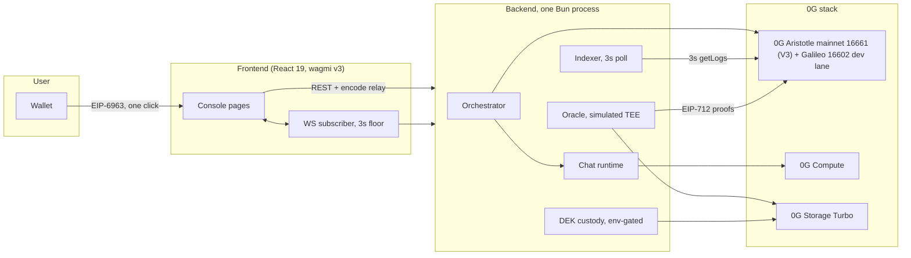
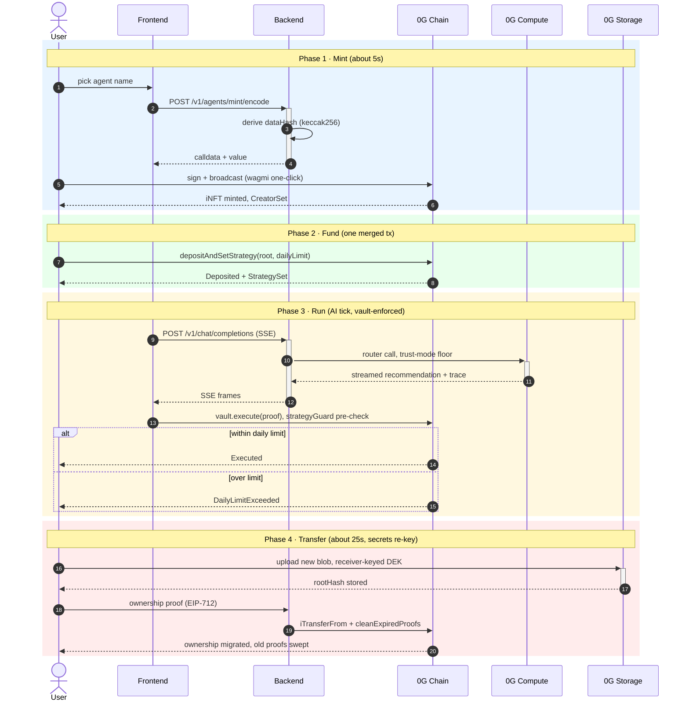
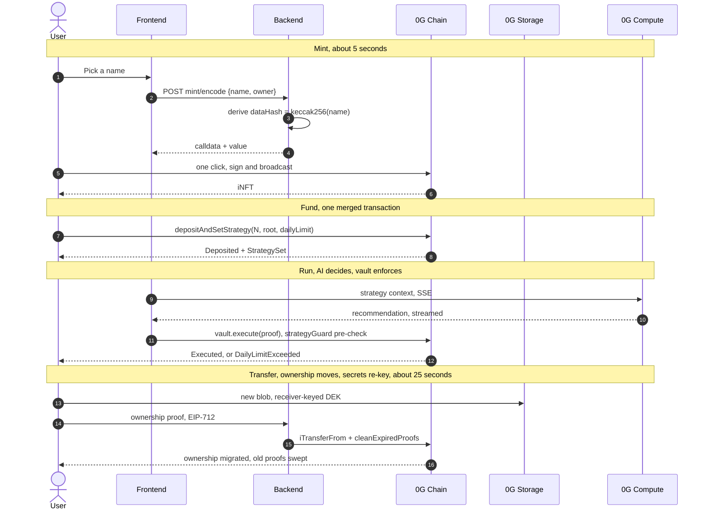
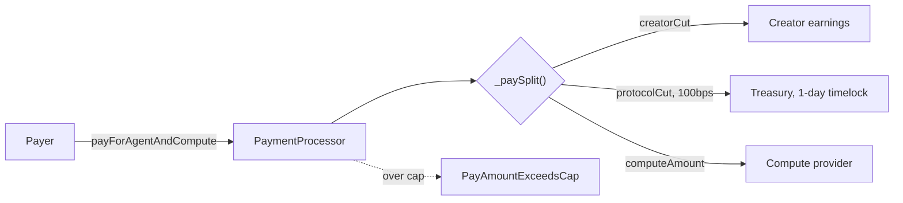
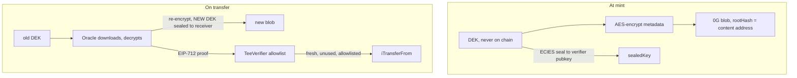

# Architecture walkthrough

Deep-dive companion to the [README architecture section](../README.md#architecture).
The component diagram lives in the README. This file carries the request lifecycle,
the user-journey traces, the payment split, and the re-key trust flow.

## Component view



## Request lifecycle

One backend process hosts the oracle, indexer, orchestrator, and chat runtime. No
cross-service hops. The frontend never touches the chain except through wagmi for user
signatures; data flows through the backend, which fans out to the three 0G services.

1. Frontend actions hit the backend as REST (encode-relay pattern: the FE shows, the
   backend encodes, the user signs through wagmi).
2. The orchestrator drives strategy ticks through the chat runtime, which calls 0G
   Compute (router path, OpenAI-compatible).
3. The oracle signs EIP-712 ownership/access proofs for transfers; its storage leg
   downloads and re-keys blobs on 0G Storage Turbo.
4. The indexer polls `getLogs` on a 3-second floor and feeds the WS event stream.
5. The DEK custody store (env-gated) holds sealed DEKs between mint and first transfer.

## Agent lifecycle (sequence, mermaid)



### Text version (renders anywhere)

```text
 User (Frontend)   Backend           TEE Oracle*            0G Chain                 0G Compute 0G Storage
|                    |                   |                     |                         |               |
==================================== STAGE 1: MINT (about 5 seconds) =====================================
| 1. pick name       |
|------------------->|
|                    | POST /mint/encode |
|                    | {name, owner}     |
| 2. derive dataHash |
|<-------------------|
|                    | keccak256(name)   |
| 3. calldata+value  |
|<-------------------|
| 4. sign + broadcast (wagmi)                                  |
|------------------------------------------------------------->|
| 5. iNFT minted, CreatorSet                                   |
|<-------------------------------------------------------------|
|                    |                   |                     |                         |               |
===================================== STAGE 2: FUND (one merged tx) ======================================
| 6. depositAndSetStrategy(root, limit)                        |
|------------------------------------------------------------->|
| 7. Deposited + StrategySet                                   |
|<-------------------------------------------------------------|
|                    |                   |                     |                         |               |
================================= STAGE 3: RUN (AI tick, vault-enforced) =================================
| 8. chat req (SSE)  |
|------------------->|
|                    | POST /v1/chat     |
|                    | (SSE stream)      |
|                    | 9. router call, trust-mode floor                                  |
|                    |------------------------------------------------------------------>|
|                    | 10. streamed recommendation                                       |
|                    |<------------------------------------------------------------------|
|                    | trace frame:      |
|                    | trust mode + usage 
| 11. SSE frames     |
|<-------------------|
| 12. vault.execute(proof)                                     |
|------------------------------------------------------------->|
|                    |                   |                     | strategyGuard pre-check;|
|                    |                   |                     | over limit:             |
|                    |                   |                     | DailyLimitExceeded      |
| 13. Executed                                                 |
|<-------------------------------------------------------------|
|                    |                   |                     |                         |               |
=========================== STAGE 4: TRANSFER (about 25 seconds, re-key dance) ===========================
| 14. start transfer |
|------------------->|
|                    | 15. rekey request |
|                    |------------------>|
|                    |                   | (in-process call)   |
|                    |                   | 16. download encrypted blob (merkle proof)                    |
|                    |                   |-------------------------------------------------------------->|
|                    |                   | decrypt + re-encrypt|
|                    |                   | (AES-256-GCM)       |
|                    |                   | receiver-keyed DEK  |
|                    |                   | 17. upload new blob (new rootHash)                            |
|                    |                   |-------------------------------------------------------------->|
|                    |                   | sign OwnershipProof |
|                    |                   | (EIP-712, domain)   |
| 18. proofs issued  |
|<-------------------|
| sign AccessProof   |
| (EIP-712)          |
| 19. submit proofs  |
|------------------->|
|                    | 20. iTransferFrom + cleanExpiredProofs  |
|                    |---------------------------------------->|
|                    |                   |                     | verify: nonce burn,     |
|                    |                   |                     | validUntil, allowlist   |
| 21. ownership migrated, proofs swept                         |
|<-------------------------------------------------------------|
| 22. success (WS)   |
|<-------------------|
|                    | WS event: success |
|                    | (3s poll floor)   |
|                    |                   |                     |                         |               |
v                    v                   v                     v                         v               v
```

## User journey



## Payment split (one canonical path)



## Trust: the re-key dance



The chain sees hashes and sealed keys only. The verifier signer allowlist means a leaked
TEE key is revoked in one transaction. The storage canary (AXIOM1 magic prefix, made
stateless via the SDK encryption header) makes silent wrong-key ciphertext downloads
impossible; AES-CTR has no built-in auth.
