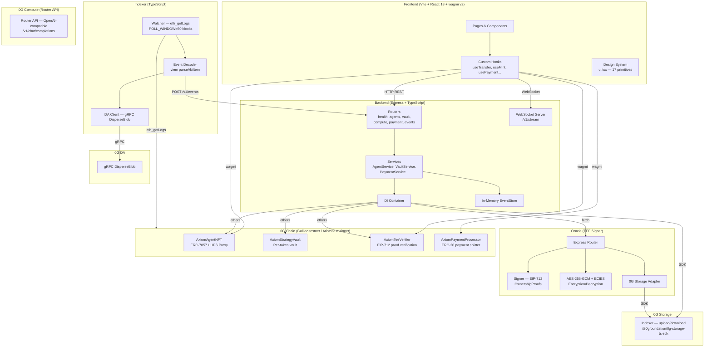
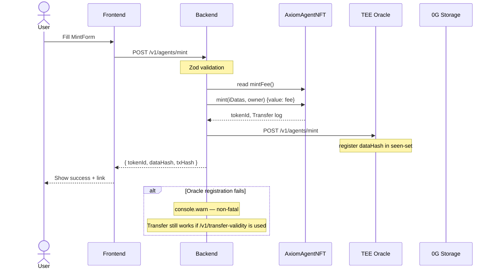
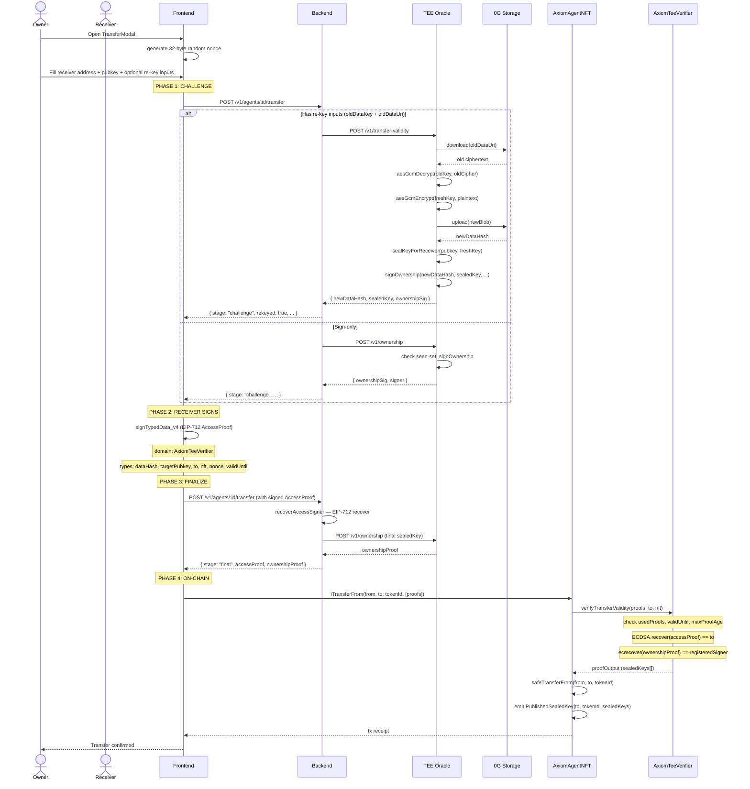
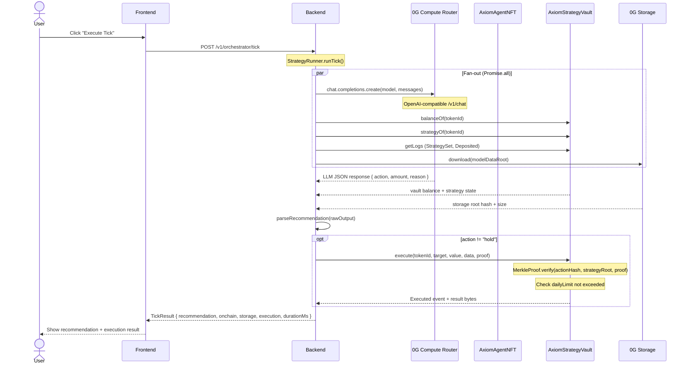
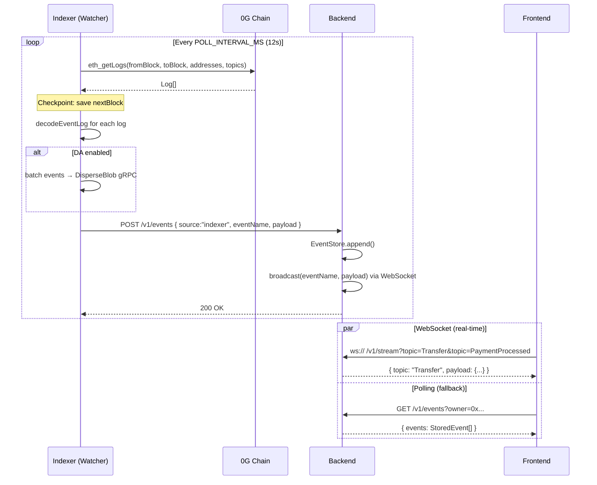
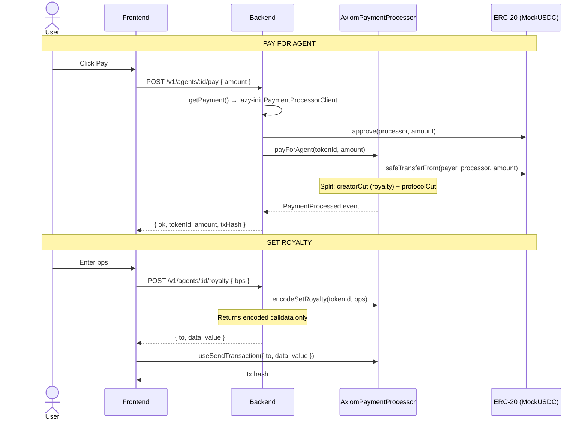
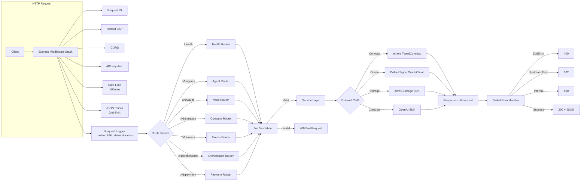
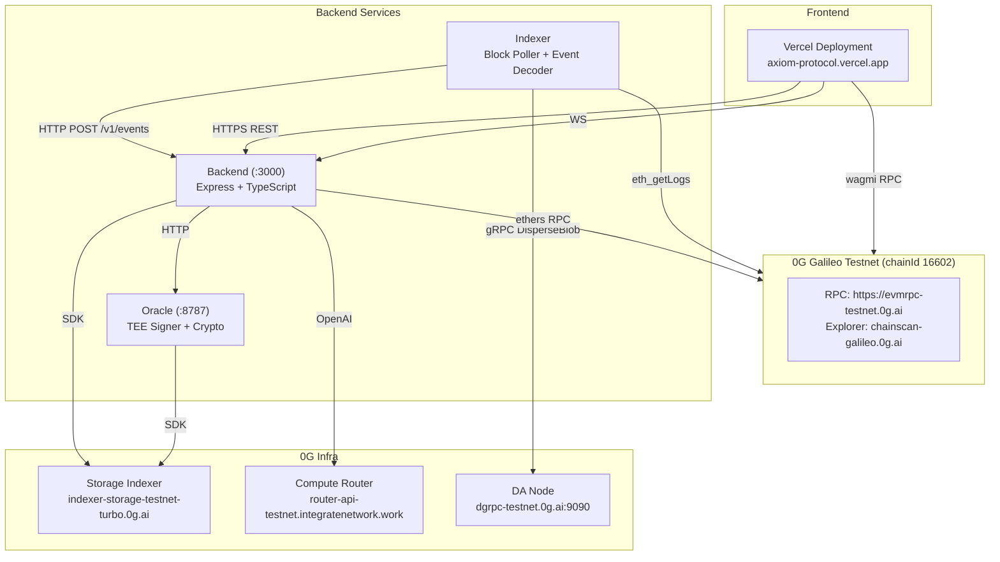

# Axiom Protocol — Architecture & Sequence Diagrams

## High-Level Service Topology

---

## Sequence Diagrams

### 1. Mint Flow — User Creates iNFT Agent

### 2. Transfer Flow — iNFT Ownership Transfer with Re-Key

### 3. Strategy Tick Flow — Orchestrator Execution

### 4. Event Streaming Flow — Indexer → Backend → Frontend

### 5. Payment Flow — Royalty + Agent Payments

### 6. Data Flow — Request Lifecycle Through the Stack

---

## Deployment Topology

