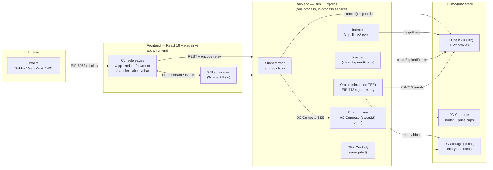
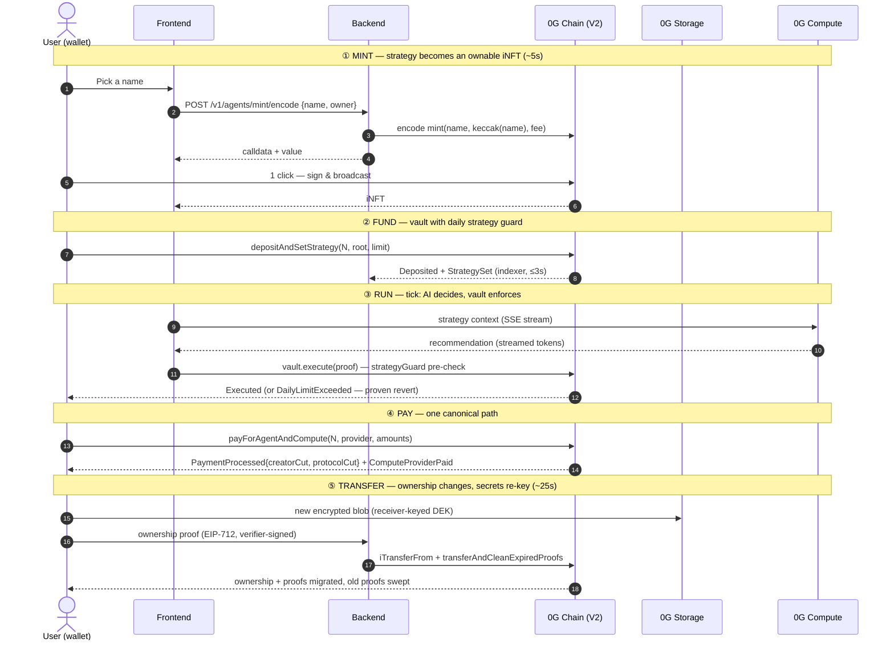
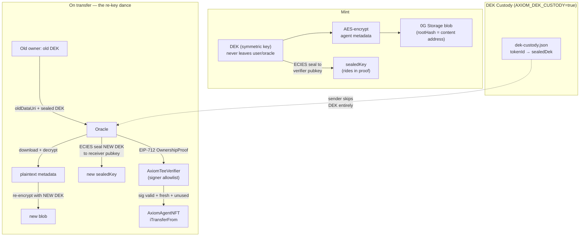
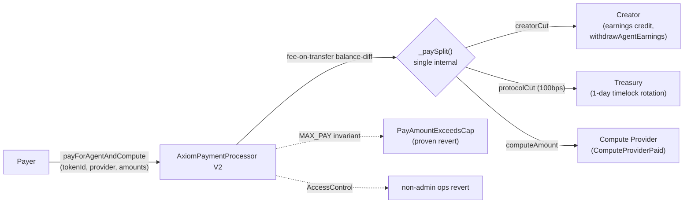
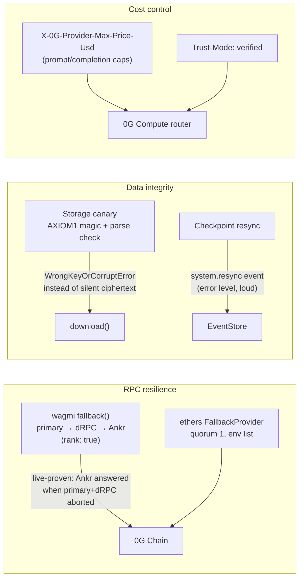
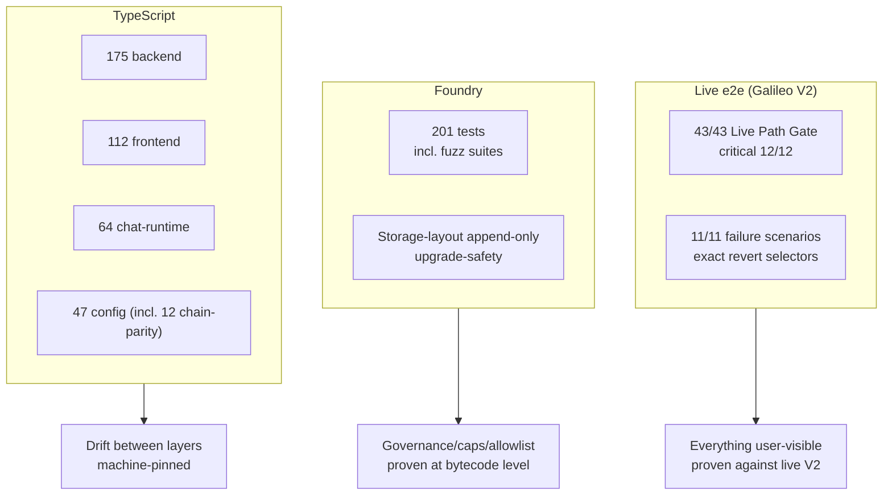
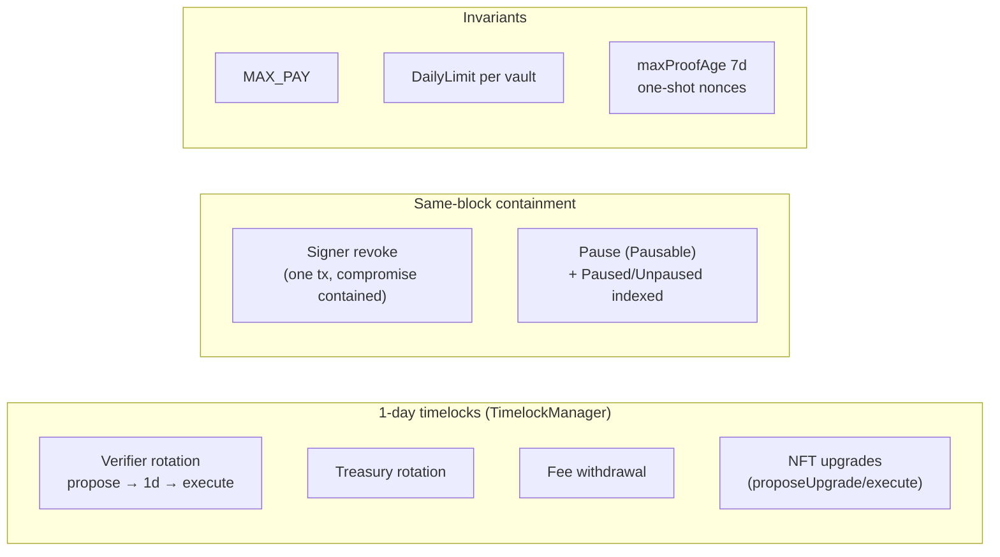
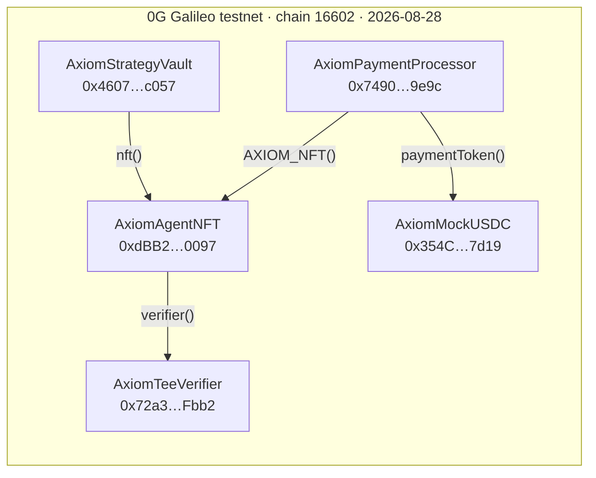

# Axiom Protocol — Mermaid Diagram Pack

Companion to `axiom-onepager.html` for the 0G Bridge Buildathon (AKINDO, 3rd Wave).
All diagrams reflect the live V2 deployment: docs/deployments/galileo-v2-2026-08-28.json (chain 16602).

---

## 1. System architecture — what runs where

**Logic (1 paragraph):** One backend process hosts four traditionally-separate services
(oracle, indexer, orchestrator, chat) — cutting cross-service latency to zero and keeping
the TEE signer off the network. The frontend never talks to the chain directly except
through wagmi for user signatures; everything data-heavy flows through the backend, which
fans out to the three 0G services. The indexer's 3-second poll is the freshness floor for
every UI surface; the WS layer pushes instead of polls wherever a subscriber exists.

---

## 2. The core loop — own → fund → run → pay → transfer

**Logic:** Every arrow is one user-visible click; everything the user never sees (hash
derivation, DEK sealing, proof freshness) is server-side. The 25-second transfer is the
headline: with DEK custody enabled (`AXIOM_DEK_CUSTODY=true`), step ⑤ needs only the
receiver address + signature — the oracle re-keys from custody and deletes the row on
success.

---

## 3. Trust architecture — why the metadata stays secret

**Logic:** The chain only ever sees hashes and seals — never the DEK, never the plaintext.
The verifier's signer allowlist (V2) means a compromised TEE key is revoked in one tx
(same-block containment), and EIP-712 proofs are domain-bound to the verifier address with
a 7-day freshness window and one-shot nonces. The I1 storage canary catches wrong-key
downloads (AES-CTR has no auth — silent ciphertext is otherwise undetectable).

---

## 4. Payment split — one canonical path

**Logic:** V2 collapsed three divergent split implementations into one `_paySplit()` and
made the per-pay cap a chain invariant — the "consistent-by-luck" era (M8) is over. The
e2e failure matrix proves both the happy split (99M/1M + 50M compute) and every guard
reverting with its exact selector.

---

## 5. Resilience — the 0G adoption layer (Wave I1)

---

## 6. Testing pyramid — what "done" means

---

## 7. Governance & safety surface (V2 hardening)

---

## 8. Deployment record (live)

All wiring asserts passed on-chain; full record: docs/deployments/galileo-v2-2026-08-28.json.
