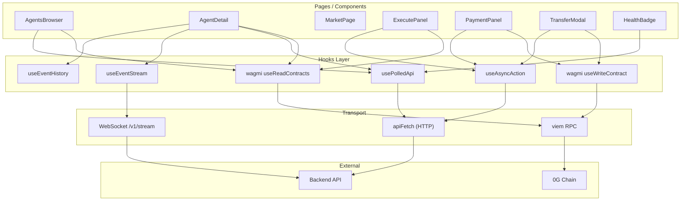
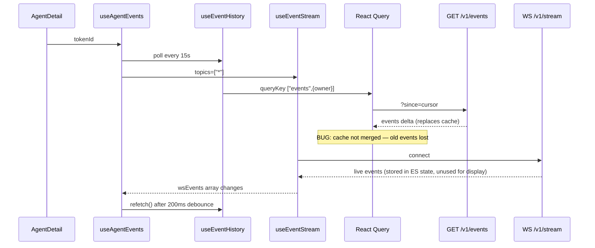
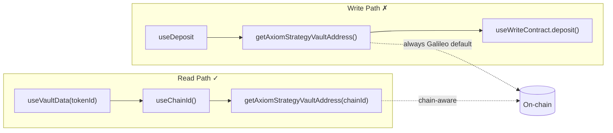

# Axiom Frontend — State, Hooks & Data Flow Analysis

**Agent:** Sub-Agent 2 — State, Hooks & Data Flow  
**Date:** 2026-07-06  
**Scope:** `apps/frontend/src/hooks/` (18 files), `config/`, `utils/`, `abi/`  
**Files read:** 30/30 in scope  

---

## Executive Summary

The Axiom frontend uses a **three-layer data architecture**:

1. **React Query** (`usePolledApi`) — HTTP polling for agents, health, performance, providers, events  
2. **Wagmi / viem** — on-chain reads (`useReadContracts`) and writes (`useWriteContract`)  
3. **Ad-hoc async** (`useAsyncAction`) + **raw WebSocket** — transfers, payments, orchestrator ticks, live events  

The layering is sound and several batch hooks (`useVaultDataBatch`, `usePerformanceBatch`) reduce N+1 fetches. However, there are **critical data-integrity bugs** in incremental event polling, **chain-ID mismatches** between reads and writes, and **Rules-of-Hooks violations** in `ExecutePanel` (consumer of scoped hooks). WebSocket usage is split: `useEventStream` accumulates live events but `useAgentEvents` discards them and only triggers HTTP refetch — an inefficient indirection.

| Severity | Count |
|----------|-------|
| Critical | 4 |
| High | 9 |
| Medium | 11 |
| Low | 8 |
| **Total findings** | **32** |

### Top 3 Issues

1. **`useEventHistory` incremental cursor polling drops historical events** — each poll replaces React Query cache with only the delta batch; activity timelines shrink to the latest poll window after ~15s.  
2. **Contract address helpers omit `chainId` in writes** — `getAxiomStrategyVaultAddress()` without `chainId` always resolves to Galileo addresses while `useVaultData` reads use the wallet's active chain.  
3. **`ExecutePanel` violates Rules of Hooks** — conditional `useAgents()` call and `useCallback` placed after an early return when wallet disconnects.

---

## Data Flow Diagrams

### High-Level Architecture



### Agent Detail — Activity Tab Data Flow



### Deposit / Vault Read-Write Flow



### State Persistence Map

| Mechanism | Keys / Location | Read | Write | Reactive? |
|-----------|-----------------|------|-------|-----------|
| `localStorage` | `axiom.wcProjectId`, `axiom.rpcUrl` | `wagmi.ts` (module init) | Settings page (out of scope) | **No** — requires reload |
| `localStorage` | `axiom:lastAgent` | `ExecutePanel` | `ExecutePanel` | Yes (component state) |
| `localStorage` | `axiom:hasUsedChat` | `ChatPage` | `ChatPage` | Yes |
| URL params | `/agents/:tokenId` | `AgentDetail` | Router | Yes |
| URL hash | `#overview`, `#execute`, etc. | `AgentDetail` | `setActiveSection` | Partial |
| React Query cache | query keys per endpoint | `usePolledApi` consumers | auto | Yes |
| Component state | form inputs, modals, phases | various | various | Yes |
| WebSocket buffers | `eventsRef`, `streamedRef` | `useEventStream`, `useOrchestratorTick` | WS handlers | Yes |

---

## Findings by Severity

### Critical

#### C1 — `useEventHistory` cursor polling replaces history instead of accumulating

| Field | Value |
|-------|-------|
| **Hook** | `useEventHistory` |
| **File** | `apps/frontend/src/hooks/useEventHistory.ts` |
| **Lines** | 68–99 |

**Evidence:**
```typescript
const lastTimestampRef = useRef(0);
// ...
const query = usePolledApi<EventsResponse>(urlGetter, {
  queryKey: ["events", { owner }],
  refetchInterval: interval,
});
// ...
const events = useMemo(() => {
  if (!query.data?.events) return [];
  return raw.length > MAX_EVENTS ? raw.slice(0, MAX_EVENTS) : raw;
}, [query.data]);
```

**What's broken:** `lastTimestampRef` advances after each fetch (`since=<cursor>`), so subsequent polls return **only new events**. React Query **replaces** `query.data` on each refetch — there is no `merge` or `placeholderData` accumulation. After the first refetch, the UI shows only the latest delta batch (often empty or tiny), not the full timeline.

**Microchange:** Maintain accumulated events in a `useRef` or `useState`, append deduped incoming events keyed by `(txHash, logIndex)`, and expose the merged array. Alternatively, drop `since` cursor and poll full history with server-side pagination.

---

#### C2 — Contract addresses default to Galileo when `chainId` omitted

| Field | Value |
|-------|-------|
| **Module** | `getContractAddress` / address getters |
| **File** | `apps/frontend/src/abi/addresses.ts` |
| **Lines** | 15–23 |

**Evidence:**
```typescript
export function getContractAddress(contract: ContractName, chainId?: number): Address {
  if (chainId !== undefined && chainId !== GALILEO_CHAIN_ID) {
    throw new Error(`Contract ${contract} not deployed on chain ${chainId}`);
  }
  return ADDRESSES[contract]; // always Galileo DEPLOYED_ADDRESSES
}
```

**What's broken:** Omitting `chainId` silently returns Galileo addresses. Wagmi config supports **Galileo + Aristotle**, but most write paths (`useDeposit`, `ExecutePanel` tick payloads, `useTransfer`, `usePayment`) call getters **without** `chainId`. Reads in `useVaultData` / `useVaultDataBatch` **do** pass `useChainId()`.

**Microchange:** Make `chainId` required (or inject via `useChainId()` wrapper hook). Throw if connected chain ≠ Galileo until Aristotle addresses exist in config.

---

#### C3 — Conditional hook call in `ExecutePanel` (consumer of `useAgents`)

| Field | Value |
|-------|-------|
| **Component** | `ExecutePanel` |
| **File** | `apps/frontend/src/components/ExecutePanel.tsx` |
| **Lines** | 174–175 |

**Evidence:**
```typescript
const { agents, isLoading: agentsLoading } =
  tokenIdProp === undefined ? useAgents() : { agents: [], isLoading: false };
```

**What's broken:** Violates Rules of Hooks — `useAgents()` is only invoked when `tokenIdProp` is undefined. Toggling props between defined/undefined across renders will crash or corrupt hook state.

**Microchange:** Always call `useAgents()`; gate usage with `enabled: tokenIdProp === undefined` inside the hook or ignore `agents` when `tokenIdProp` is set.

---

#### C4 — `useCallback` after early return in `ExecutePanel`

| Field | Value |
|-------|-------|
| **Component** | `ExecutePanel` |
| **File** | `apps/frontend/src/components/ExecutePanel.tsx` |
| **Lines** | 240–248 |

**Evidence:**
```typescript
if (!isConnected) {
  return (<Card>...</Card>);
}
const onExecute = useCallback(async (): Promise<void> => { ... }, [...]);
```

**What's broken:** When `isConnected` flips, hook call order changes (fewer hooks when disconnected). React will throw invariant violations in Strict Mode.

**Microchange:** Move `onExecute` `useCallback` above the early return; render disconnected UI conditionally in JSX instead.

---

### High

#### H1 — `useDeposit` read/write address chain mismatch

| Field | Value |
|-------|-------|
| **Hook** | `useDeposit` |
| **File** | `apps/frontend/src/hooks/useDeposit.ts` |
| **Lines** | 13–14, 34–40 |

**Evidence:**
```typescript
const vd = useVaultData(tokenId); // uses useChainId() internally
const vaultAddr = getAxiomStrategyVaultAddress(); // no chainId
doDeposit({ address: vaultAddr, ... });
```

**What's broken:** Deposit transaction may target Galileo vault while balance display reads from the wallet's active chain vault.

**Microchange:** `const chainId = useChainId(); const vaultAddr = getAxiomStrategyVaultAddress(chainId);`

---

#### H2 — `useAgentEvents` discards WebSocket events; triggers HTTP refetch storm

| Field | Value |
|-------|-------|
| **Hook** | `useAgentEvents` |
| **File** | `apps/frontend/src/hooks/useAgentEvents.ts` |
| **Lines** | 21–27, 29–38 |

**Evidence:**
```typescript
const { events: wsEvents } = useEventStream({ topics: ["*"] });
useEffect(() => {
  if (wsEvents.length === 0) return;
  const t = setTimeout(refetch, 200);
  return () => clearTimeout(t);
}, [wsEvents, refetch]);
// agentEvents filtered from HTTP `events` only — wsEvents never merged
```

**What's broken:** Every WS message creates a new `events` array reference in `useEventStream`, retriggering debounced refetch. Display data never uses WS payload directly — adds latency and redundant HTTP load. Combined with C1, refetched data may be incomplete.

**Microchange:** Merge WS events into local state with dedup, or filter `wsEvents` by `tokenId` and prepend to `agentEvents`. Refetch only on reconnect or use WS as sole live source.

---

#### H3 — `useOrchestratorTick` WebSocket stream lacks lifecycle safety

| Field | Value |
|-------|-------|
| **Hook** | `useOrchestratorTick` |
| **File** | `apps/frontend/src/hooks/useOrchestratorTick.ts` |
| **Lines** | 131–173 |

**Evidence:**
```typescript
return await new Promise<TickResult>((resolve, reject) => {
  const ws = new WebSocket(wsUrl.toString());
  // ws.onmessage, ws.onerror — no ws.onclose fallback
  // no connection-open timeout
});
```

**What's broken:** If the server closes without a `complete`/`error` payload, the Promise never settles; `isStreaming` clears in `finally` but callers hang. No guard against orphaned WebSockets on rapid cancel/retry.

**Microchange:** Add `ws.onclose` reject, `open` timeout, and store `ws` on ref for `cancelTick()` to call `ws.close()`.

---

#### H4 — `wagmi.ts` reads `localStorage` once at module load

| Field | Value |
|-------|-------|
| **Module** | `wagmiConfig` |
| **File** | `apps/frontend/src/config/wagmi.ts` |
| **Lines** | 10–21 |

**Evidence:**
```typescript
const storedWcProjectId = typeof window !== "undefined" ? window.localStorage.getItem("axiom.wcProjectId") ?? "" : "";
const storedRpcUrl = /* same pattern */;
// used immediately in getDefaultConfig — never re-read
```

**What's broken:** Settings changes to RPC URL or WalletConnect project ID require full page reload. Data flow from Settings → wallet is broken at runtime.

**Microchange:** Export a `createWagmiConfig()` called from a provider that listens to `storage` events, or rebuild config via `useMemo` + custom provider wrapper.

---

#### H5 — `usePayment.resetPay` is a no-op

| Field | Value |
|-------|-------|
| **Hook** | `usePayment` |
| **File** | `apps/frontend/src/hooks/usePayment.ts` |
| **Lines** | 139 |

**Evidence:**
```typescript
resetPay: () => {},
```

**What's broken:** Interface promises reset capability; wagmi `payError` from `useWriteContract` cannot be cleared via this API. Consumers cannot recover UI from a stale pay error without remounting.

**Microchange:** Expose wagmi's `reset` from `useWriteContract` as `resetPay`, matching `useTransfer.resetWrite` pattern.

---

#### H6 — `useVaultData` vs `useVaultDataBatch` inconsistent failure semantics

| Field | Value |
|-------|-------|
| **Hooks** | `useVaultData`, `useVaultDataBatch` |
| **Files** | `useVaultData.ts:41-48`, `useVaultDataBatch.ts:46-52` |
| **Lines** | see files |

**Evidence:**
```typescript
// useVaultData
useReadContracts({ allowFailure: false, ... });

// useVaultDataBatch
useReadContracts({ contracts, ... }); // allowFailure defaults true
```

**What's broken:** Single-agent view fails fast on any contract error; batch view silently returns `0n` / empty strategy for failed sub-calls. Agents browser may show misleading zero balances.

**Microchange:** Align `allowFailure` and surface per-token error flags in `VaultDataEntry`.

---

#### H7 — `useAgentEvents` tokenId filter misses alternate payload keys

| Field | Value |
|-------|-------|
| **Hook** | `useAgentEvents` |
| **File** | `apps/frontend/src/hooks/useAgentEvents.ts` |
| **Lines** | 33–36 |

**Evidence:**
```typescript
events.filter((ev) =>
  String((ev.payload as Record<string, unknown>)?.tokenId) === tokenId.toString(),
);
```

**What's broken:** `utils/events.ts` defines `eventTokenId()` checking `tokenId`, `agentTokenId`, `_tokenId` — but the hook only checks `tokenId`. Events using alternate keys are invisible in Activity tab.

**Microchange:** Use `eventTokenId(ev) === tokenId.toString()` from `utils/events.ts`.

---

#### H8 — Dual `AbortController` layers in `useOrchestratorTick`

| Field | Value |
|-------|-------|
| **Hook** | `useOrchestratorTick` |
| **File** | `apps/frontend/src/hooks/useOrchestratorTick.ts` |
| **Lines** | 67–84, 25 |

**Evidence:**
```typescript
const { execute } = useAsyncAction(); // creates abortRef #1
abortControllerRef.current = controller; // abortRef #2
return execute(async (signal) => {
  const combinedSignal = AbortSignal.any([signal, controller.signal]);
```

**What's broken:** `cancelTick()` aborts #2 but `execute`'s loading/error state may desync. Overlapping `tick()` + `tickStream()` calls race on shared `abortControllerRef`.

**Microchange:** Use single abort source — either drop outer ref and use `execute`'s signal only, or bypass `useAsyncAction` for streaming.

---

#### H9 — `ExecutePanel` tick requests use chain-unaware contract addresses

| Field | Value |
|-------|-------|
| **Component** | `ExecutePanel` (uses `useOrchestratorTick`, address getters) |
| **File** | `apps/frontend/src/components/ExecutePanel.tsx` |
| **Lines** | 258–271 |

**Evidence:**
```typescript
res = await tickStream({
  vault: getAxiomStrategyVaultAddress(),
  agentNft: getAxiomAgentNftAddress(),
  agentTokenId: activeId,
}, {});
```

**What's broken:** Orchestrator receives Galileo addresses regardless of wallet chain. Extends C2 into the tick execution data path.

**Microchange:** `const chainId = useChainId()` and pass to all address getters.

---

### Medium

#### M1 — Inconsistent loading flags: `isLoading` vs `isFetching`

| Hook | Flag used | File:Line |
|------|-----------|-----------|
| `useProviders` | `isFetching` | `useProviders.ts:31` |
| `useEventHistory` | `isFetching` | `useEventHistory.ts:109` |
| `useAgents` | `isLoading` | `useAgents.ts:30,46` |
| `usePerformance` | `isLoading` | `usePerformance.ts:27` |

**What's broken:** `isLoading` is true only on first fetch with no cache; `isFetching` is true on every poll. Provider/event UIs show background refresh; agent/performance UIs may not indicate stale-while-revalidate.

**Microchange:** Standardize on `isFetching` for polled hooks or expose both `isLoading` and `isRefreshing`.

---

#### M2 — `useAsyncAction.cancel()` does not set `cancelledRef`

| Field | Value |
|-------|-------|
| **Hook** | `useAsyncAction` |
| **File** | `apps/frontend/src/hooks/useAsyncAction.ts` |
| **Lines** | 50–52 |

**Evidence:**
```typescript
const cancel = useCallback(() => {
  abortRef.current?.abort();
}, []);
```

**What's broken:** Only unmount sets `cancelledRef.current = true`. Manual `cancel()` aborts the fetch but `setError` may still run if the catch block executes before abort propagates.

**Microchange:** Set `cancelledRef.current = true` in `cancel()` and reset in `execute()`.

---

#### M3 — Duplicate `API_KEY` definition; `env.ts` export unused

| Files | Lines |
|-------|-------|
| `config/env.ts` | 4 |
| `utils/apiFetch.ts` | 3 |

**Evidence:** `env.ts` exports `API_KEY`; `apiFetch.ts` re-declares `const API_KEY = import.meta.env.VITE_API_KEY ?? ""`. `ChatPage.tsx:699` reads env a third time for streaming.

**Microchange:** Single import from `config/env.ts` everywhere.

---

#### M4 — Bare `QueryClient` with no global defaults

| Field | Value |
|-------|-------|
| **File** | `apps/frontend/src/main.tsx` |
| **Lines** | 15 |

**Evidence:** `const queryClient = new QueryClient();` — no `defaultOptions` for `staleTime`, `gcTime`, `retry`, or `networkMode`.

**Microchange:** Configure shared defaults aligned with `usePolledApi` (e.g. `refetchOnWindowFocus: false` for polling-heavy app).

---

#### M5 — `usePerformanceBatch` URL length risk for large agent lists

| Field | Value |
|-------|-------|
| **Hook** | `usePerformanceBatch` |
| **File** | `apps/frontend/src/hooks/usePerformanceBatch.ts` |
| **Lines** | 28–30 |

**Evidence:** `?ids=${tokenIds.map(...).join(",")}` — unbounded comma-separated IDs.

**Microchange:** POST batch endpoint or chunk IDs into multiple queries with merged `Map`.

---

#### M6 — `useTransfer` leaves `transferPhase` set on mid-flow failure

| Field | Value |
|-------|-------|
| **Hook** | `useTransfer` |
| **File** | `apps/frontend/src/hooks/useTransfer.ts` |
| **Lines** | 87–191 |

**Evidence:** `setTransferPhase("challenge"|"signing"|"finalizing")` inside `execute`; only success path sets `"idle"`. Thrown errors leave phase stuck (e.g. `"signing"`) until manual `reset()`.

**Microchange:** `finally` block in `prepare` that resets phase to `"idle"` on error, or set phase in `useAsyncAction` error handler.

---

#### M7 — `useEventStream` always subscribes to `topics: ["*"]` from `useAgentEvents`

| Field | Value |
|-------|-------|
| **Hook** | `useAgentEvents` → `useEventStream` |
| **Files** | `useAgentEvents.ts:21`, `useEventStream.ts:43-114` |

**What's broken:** Wildcard WS subscription runs whenever Agent Detail mounts, regardless of active tab — unnecessary bandwidth/CPU on Overview/Execute tabs.

**Microchange:** Pass `enabled: activeSection === 'activity'` from consumer, or topic `agent.${tokenId}`.

---

#### M8 — `AgentDetail` runs data hooks before invalid `tokenId` guard

| Field | Value |
|-------|-------|
| **Page** | `AgentDetail` |
| **File** | `apps/frontend/src/pages/AgentDetail.tsx` |
| **Lines** | 61–70 vs 88–96 |

**Evidence:**
```typescript
const tokenId = parseTokenId(params.tokenId);
const metadata = useAgentMetadata(tokenId ?? 0n); // fetches token 0
// ...
if (tokenId === null) return <Alert>...</Alert>;
```

**Microchange:** Parse tokenId first; pass `enabled: tokenId !== null && tokenId > 0n` into hooks.

---

#### M9 — `usePolledApi` default `queryKey` collision for getters without explicit key

| Field | Value |
|-------|-------|
| **Hook** | `usePolledApi` |
| **File** | `apps/frontend/src/hooks/usePolledApi.ts` |
| **Lines** | 46–50 |

**Evidence:** `defaultKey = typeof url === "string" ? [url] : ["polled-api"]` — multiple getter-based polls without `queryKey` would share cache.

**Microchange:** Require `queryKey` when `urlOrGetter` is a function (TypeScript discriminated union).

---

#### M10 — `usePayment.payForAgent` returns `payment: null` always

| Field | Value |
|-------|-------|
| **Hook** | `usePayment` |
| **File** | `apps/frontend/src/hooks/usePayment.ts` |
| **Lines** | 81–87 |

**Evidence:** `payment: null` hardcoded; `AgentPayResult.payment` typed `unknown` but never populated from backend.

**Microchange:** Remove field or fetch payment receipt from API after tx confirmation.

---

#### M11 — `useEventHistory` `owner` filter accepted but never passed from `useAgentEvents`

| Field | Value |
|-------|-------|
| **Hook** | `useEventHistory` |
| **File** | `useEventHistory.ts:31,72-74` |

**Evidence:** `owner` query param supported; `useAgentEvents` calls `useEventHistory({ pollIntervalMs: 15_000 })` without owner — fetches **all** events then client-filters by tokenId.

**Microchange:** Pass connected wallet `owner` or add server-side `tokenId` filter param.

---

### Low

#### L1 — `utils/events.ts` helpers are completely unwired

| Field | Value |
|-------|-------|
| **File** | `apps/frontend/src/utils/events.ts` |
| **Lines** | 4–14 |

**Evidence:** `eventField`, `eventTokenId` — zero imports outside the file (grep confirmed).

**Microchange:** Wire into `useAgentEvents` / `EventTimeline`, or delete.

---

#### L2 — Dead `isLoading` variable in `useTransfer`

| Field | Value |
|-------|-------|
| **Hook** | `useTransfer` |
| **File** | `apps/frontend/src/hooks/useTransfer.ts` |
| **Lines** | 64–68 |

**Evidence:** `const isLoading = actionLoading || isWritePending` computed but never used; return uses inline expression.

**Microchange:** Remove dead variable or use it in `useWarnTimeout` deps consistently.

---

#### L3 — `useDeposit` weak amount validation vs shared `validateNumericInput`

| Field | Value |
|-------|-------|
| **Hook** | `useDeposit` |
| **File** | `apps/frontend/src/hooks/useDeposit.ts` |
| **Lines** | 43–46 |

**Evidence:** Uses `Number(depositAmount) > 0` — allows scientific notation, imprecise for wei. `DepositForm` uses `validateNumericInput` separately — split validation logic.

**Microchange:** Move validation into hook using `validateNumericInput` + `parseEther` try/catch.

---

#### L4 — `EXPLORER_BASE` hardcoded to mainnet

| Field | Value |
|-------|-------|
| **File** | `apps/frontend/src/utils/constants.ts` |
| **Lines** | 4 |

**Evidence:** `https://chainscan.0g.ai` — `chains.ts` defines per-chain explorers; `TradeHistory` links may be wrong on Galileo testnet.

**Microchange:** Use `resolveBlockExplorerUrl(chainId)` like `MarketPage`.

---

#### L5 — Misleading log label in `useEventStream`

| Field | Value |
|-------|-------|
| **Hook** | `useEventStream` |
| **File** | `apps/frontend/src/hooks/useEventStream.ts` |
| **Lines** | 89–91 |

**Evidence:** `console.warn("[useEventStream] WS connect failed:", err)` inside `onmessage` parse catch — not a connect failure.

**Microchange:** Rename to `"Failed to parse WS message"`.

---

#### L6 — Duplicate identical `useWarnTimeout` calls in `useTransfer`

| Field | Value |
|-------|-------|
| **Hook** | `useTransfer` |
| **File** | `apps/frontend/src/hooks/useTransfer.ts` |
| **Lines** | 65–74 |

**Evidence:** Two timeouts with different messages but both gated on same `isLoading` — both fire at 30s simultaneously.

**Microchange:** Gate each on `transferPhase` (`challenge` vs `confirming`).

---

#### L7 — `useVaultData` enables fetch for `tokenId >= 0n` (always true)

| Field | Value |
|-------|-------|
| **Hook** | `useVaultData` |
| **File** | `apps/frontend/src/hooks/useVaultData.ts` |
| **Lines** | 46 |

**Evidence:** `enabled: tokenId >= 0n` — includes `0n`; should be `tokenId > 0n` to match `useAgentMetadata` / `usePerformance`.

**Microchange:** Align enabled guard across hooks.

---

#### L8 — `env.ts` `BACKEND_URL` duplicated import pattern

| Files | Notes |
|-------|-------|
| `useOrchestratorTick.ts`, `useEventStream.ts`, `apiFetch.ts`, `HealthBadge.tsx`, `ChatPage.tsx` | All import `BACKEND_URL` separately for WS URL construction |

**Microchange:** Extract `buildWsUrl(path)` helper next to `apiFetch` to centralize scheme flipping logic (duplicated in two hooks).

---

## Dangling Code Inventory

| Symbol | File | Lines | Status | Notes |
|--------|------|-------|--------|-------|
| `eventField` | `utils/events.ts` | 4–7 | **Unwired** | No consumers |
| `eventTokenId` | `utils/events.ts` | 10–14 | **Unwired** | Duplicates logic partially in `useAgentEvents` |
| `API_KEY` export | `config/env.ts` | 4 | **Unwired** | `apiFetch` redefines; nothing imports from `env.ts` |
| `resetPay` | `usePayment.ts` | 139 | **Stub** | Empty function in public API |
| `isLoading` (local) | `useTransfer.ts` | 64 | **Dead** | Shadowed by return expression |
| `usePerformance` (singular) | `usePerformance.ts` | 23 | **Underused** | Only `AgentDetail`; batch variant used in browser — intentional split |
| `useVaultData` (singular) | `useVaultData.ts` | 18 | **Partially used** | `ExecutePanel` + `useDeposit`; batch variant in browser |
| `useEventHistory` | `useEventHistory.ts` | 60 | **Internal only** | Only consumed via `useAgentEvents` |
| `useEventStream` | `useEventStream.ts` | 25 | **Indirect only** | Only consumed via `useAgentEvents`; events not displayed |
| `agentPath` (direct) | `utils/apiPaths.ts` | 1 | **Internal** | Only used by sibling path helpers |
| `axiomAgentNftAbi` / `axiomStrategyVaultAbi` | `abi/*.ts` | — | **Thin re-exports** | Pass-through from `@axiom/config/abis` |
| `ACCESS_PROOF_TYPES` re-export | `abi/eip712.ts` | 11 | **Used** | `useTransfer` imports from here |

---

## Microchange Opportunities

| Priority | Change | Effort | Impact |
|----------|--------|--------|--------|
| P0 | Fix `useEventHistory` event accumulation | ~30 LOC | Restores Activity timeline |
| P0 | Pass `useChainId()` to all address getters in write paths | ~15 call sites | Prevents wrong-chain txs |
| P0 | Fix `ExecutePanel` hook ordering | ~10 LOC | Prevents React crashes |
| P1 | Merge WS events in `useAgentEvents` | ~25 LOC | Lower latency, fewer HTTP calls |
| P1 | `useOrchestratorTick` WS `onclose`/timeout | ~20 LOC | Prevents hung promises |
| P1 | Reactive `wagmi` config from localStorage | ~40 LOC | Settings work without reload |
| P2 | Standardize `isFetching` across polled hooks | ~10 LOC | Consistent loading UX |
| P2 | Wire `eventTokenId` into event filters | ~3 LOC | Fewer missed events |
| P2 | `usePayment.resetPay` → wagmi reset | ~2 LOC | Error recovery |
| P3 | `buildWsUrl()` helper | ~15 LOC | DRY WS URL construction |
| P3 | `validateNumericInput` in `useDeposit` | ~10 LOC | Consistent validation |

---

## Positive Findings

1. **`usePolledApi` getter-ref pattern** (`usePolledApi.ts:41-44`) — stable `queryKey` with dynamic URL via ref avoids cache-key flicker; well-documented.

2. **`useAsyncAction` abort hygiene** — aborts prior request on re-execute, skips `setError` on `AbortError`, cleans up on unmount (`useAsyncAction.ts:17-45`).

3. **Batch hooks reduce N+1** — `useVaultDataBatch` and `usePerformanceBatch` consolidate multicall / batch API for `AgentsBrowser`.

4. **`apiFetch` resilience** — timeout, retry with backoff for GET, `NetworkError` wrapping, idempotent-read retry policy (`apiFetch.ts:37-108`).

5. **Stream token debouncing** — `useOrchestratorTick` batches WS tokens via 50ms flush interval and caps buffer at 50k chars (`useOrchestratorTick.ts:38-65`).

6. **React Query deduplication** — `useHealth` called from both `HealthBadge` and `AgentDetail` shares `queryKey: ["/health"]`; only one poll interval runs.

7. **`useEventStream` reconnect backoff** — exponential delay capped at 30s with `enabledRef` guard against reconnect after unmount (`useEventStream.ts:99-109`).

8. **`useEip712Domain`** — correctly binds `chainId` + `verifyingContract` for typed-data signing (`abi/eip712.ts:23-39`).

9. **`useTransfer` phase machine** — `transferPhase` states enable precise UX error messages in `TransferModal` (good separation of flow state from async state).

10. **Centralized error humanization** — `humanizeError` used consistently across deposit, payment, transfer, and execute flows.

---

## Appendix: Hook Consumer Matrix

| Hook | Direct consumers |
|------|------------------|
| `usePolledApi` | `useAgents`, `useHealth`, `useProviders`, `usePerformance`, `usePerformanceBatch`, `useEventHistory`, `MarketPage` |
| `useAsyncAction` | `useTransfer`, `usePayment`, `useOrchestratorTick` |
| `useAgents` | `AgentsBrowser`, `ExecutePanel` (conditional ⚠️) |
| `useVaultData` | `useDeposit`, `ExecutePanel` |
| `useVaultDataBatch` | `AgentsBrowser` |
| `usePerformance` | `AgentDetail` |
| `usePerformanceBatch` | `AgentsBrowser` |
| `useAgentMetadata` | `AgentDetail` |
| `useAgentEvents` | `AgentDetail` |
| `useEventHistory` | `useAgentEvents` only |
| `useEventStream` | `useAgentEvents` only |
| `useOrchestratorTick` | `ExecutePanel` |
| `useDeposit` | `DepositForm` |
| `usePayment` | `PaymentPanel` |
| `useTransfer` | `TransferModal` |
| `useHealth` | `HealthBadge`, `AgentDetail` |
| `useProviders` | `MarketPage` |
| `useMediaQuery` | `App`, `ProviderCard`, `EventTimeline` |

---

*End of report.*